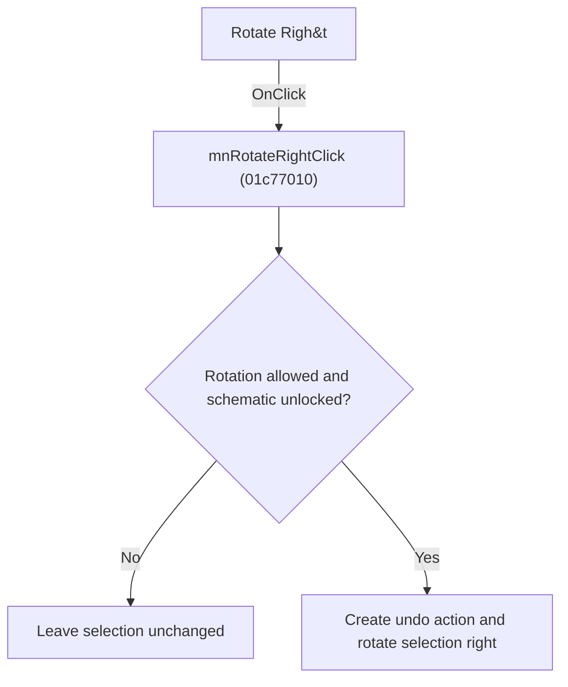

# Rotate Righ&t

> Analysis status: Individually reviewed.

## Control

| Property | Recovered value |
| --- | --- |
| Form | SchematicEditor |
| Component path | SchematicEditor.SchPopup.pmRotateRight |
| Control class | TMenuItem |
| Caption | Rotate Righ&t |
| Hint | Not present in the recovered resource. |
| Text | Not present in the recovered resource. |
| Handler name | mnRotateRightClick |
| Handler address | 01c77010 |
| Graph node | `resource:dfm:SchematicEditor/SchematicEditor.SchPopup.pmRotateRight` |
| Handler node | `function:01c77010` |
| Graph layer | UI |

## What happens when clicked

The handler forwards the click to the traced rotate-right operation. Sender is unused, so the menu and popup controls behave identically.

## Click flow

## Handler evidence

- Source: [DecompiledSources/Tina16/functions/0000000001C77010__FUN_01c77010.c](../../../DecompiledSources/Tina16/functions/0000000001C77010__FUN_01c77010.c)
- Recovered role: Rotate selected schematic objects right.
- Current graph summary: Handles 2 Delphi UI events: SchematicEditor.MainMenu.Edit.mnRotateRight.OnClick, SchematicEditor.SchPopup.pmRotateRight.OnClick.
- Current graph behavior: The handler forwards the click to the traced rotate-right operation. Sender is unused, so the menu and popup controls behave identically.
- Current graph evidence: The recovered body is a single call to FUN_01c6d2f0, whose permission, undo, transform, redraw, and result paths were inspected.
- Complexity: simple
- Distinct outgoing calls: 1

## Direct calls

- `function:01c6d2f0` — FUN_01c6d2f0

## Resource evidence

- Kind: Not present in the recovered resource.
- Modal result: Not present in the recovered resource.
- Checked state: Not present in the recovered resource.
- List items: Not present in the recovered resource.
- Image reference: Not present in the recovered resource.
- Extracted glyph: None.

## Nearby label candidates

Nearby labels are layout candidates only. They are not proof of behavior.

- No same-parent label candidate is available.

## Analysis limits

- No control-specific branch exists in this wrapper.

