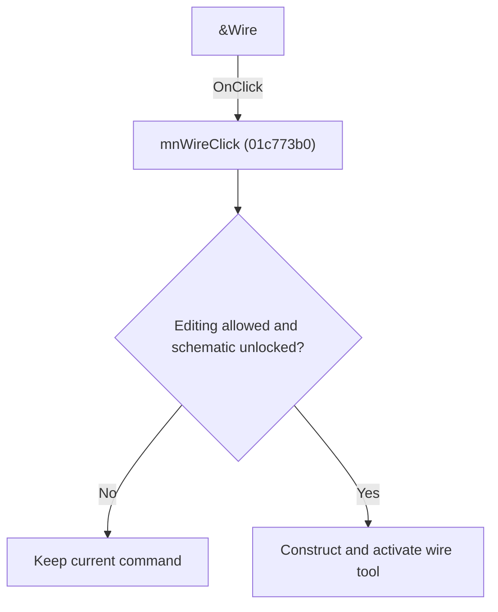

# &Wire

> Analysis status: Individually reviewed.

## Control

| Property | Recovered value |
| --- | --- |
| Form | SchematicEditor |
| Component path | SchematicEditor.SchPopup.pmWire |
| Control class | TMenuItem |
| Caption | &Wire |
| Hint | Not present in the recovered resource. |
| Text | Not present in the recovered resource. |
| Handler name | mnWireClick |
| Handler address | 01c773b0 |
| Graph node | `resource:dfm:SchematicEditor/SchematicEditor.SchPopup.pmWire` |
| Handler node | `function:01c773b0` |
| Graph layer | UI |

## What happens when clicked

The handler delegates to ToolWireClick, which checks editing permission and lock state, constructs a wire command, replaces the current command, and activates the wire tool. Sender is unused.

## Click flow

## Handler evidence

- Source: [DecompiledSources/Tina16/functions/0000000001C773B0__FUN_01c773b0.c](../../../DecompiledSources/Tina16/functions/0000000001C773B0__FUN_01c773b0.c)
- Recovered role: Activate the wire placement tool.
- Current graph summary: Handles 2 Delphi UI events: SchematicEditor.MainMenu.Insert.mnWire.OnClick, SchematicEditor.SchPopup.pmWire.OnClick.
- Current graph behavior: The handler delegates to ToolWireClick, which checks editing permission and lock state, constructs a wire command, replaces the current command, and activates the wire tool. Sender is unused.
- Current graph evidence: The recovered wrapper calls FUN_01c6d6f0, whose guard, wire-tool construction, command replacement, and toolbar activation were inspected.
- Complexity: simple
- Distinct outgoing calls: 1

## Direct calls

- `function:01c6d6f0` — Handles 1 Delphi UI event: SchematicEditor.TopToolBar.EditorTools.ToolWire.OnClick.

## Resource evidence

- Kind: Not present in the recovered resource.
- Modal result: Not present in the recovered resource.
- Checked state: Not present in the recovered resource.
- List items: Not present in the recovered resource.
- Image reference: Not present in the recovered resource.
- Extracted glyph: None.

## Nearby label candidates

Nearby labels are layout candidates only. They are not proof of behavior.

- No same-parent label candidate is available.

## Analysis limits

- No control-specific branch exists in this wrapper.

