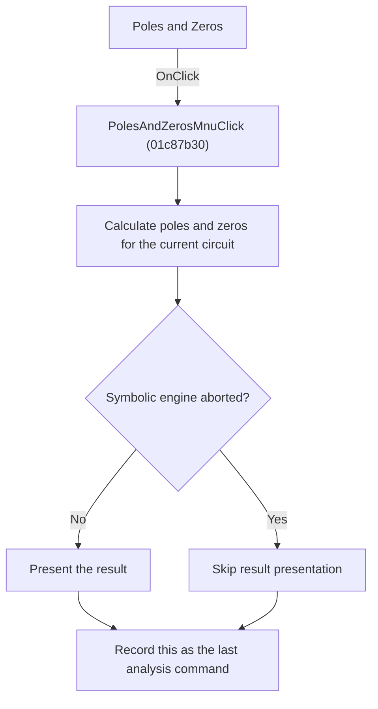

# Poles and Zeros

> Analysis status: Reviewed from recovered source and graph evidence.

## Control

| Property | Recovered value |
| --- | --- |
| Form | SchematicEditor |
| Component path | SchematicEditor.MainMenu.mnAnalysis.Symbolic1.PolesAndZerosMnu |
| Control class | TMenuItem |
| Caption | Poles and Zeros |
| Handler name | PolesAndZerosMnuClick |
| Handler address | 01c87b30 |
| Graph node | `resource:dfm:SchematicEditor/SchematicEditor.MainMenu.mnAnalysis.Symbolic1.PolesAndZerosMnu` |
| Handler node | `function:01c87b30` |
| Graph layer | UI |

## What happens when clicked

Runs the symbolic poles-and-zeros calculation for the current circuit and registers this command as the last analysis command after the calculation returns.

## Click flow

## Handler evidence

- Source: [DecompiledSources/Tina16/functions/0000000001C87B30__FUN_01c87b30.c](../../../DecompiledSources/Tina16/functions/0000000001C87B30__FUN_01c87b30.c)
- Recovered role: Run symbolic poles-and-zeros analysis.
- Evidence: The handler passes SchematicEditor +0x2788 to FUN_0145f4e0. That function initializes the symbolic engine, runs FUN_0145e3a0, presents output through FUN_013e0a40 when the engine is not aborted, and cleans the engine. The handler then writes PolesAndZerosMnuClick to +0x27e8.

## Application-relevant calls

- FUN_0145f4e0 owns the symbolic calculation and result presentation.

## Resource evidence

- The DFM binds this menu item to `PolesAndZerosMnuClick`.
- The recovered caption is `Poles and Zeros`.
- No extracted glyph is associated with this control.

## Analysis limits

- The recovered names of some form fields and global state bytes are not available. This article identifies them by stable offsets and proven readers or writers where necessary.