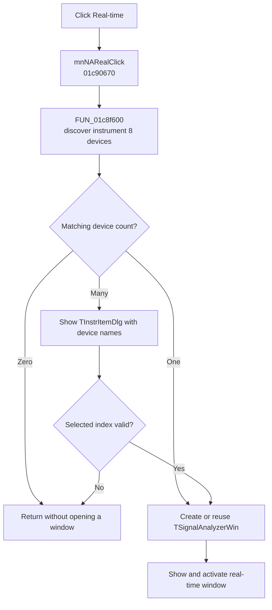

# Real-time

> Analysis status: Evidence-backed source review complete.

## Control

| Property | Recovered value |
| --- | --- |
| Form | SchematicEditor |
| Component path | SchematicEditor.MainMenu.mnTM.NetworkAnalyzer1.Real1 |
| Control class | TMenuItem |
| Caption | Real-time |
| Hint | Not present in the recovered resource. |
| Text | Not present in the recovered resource. |
| Handler name | mnNARealClick |
| Handler address | 01c90670 |
| Graph node | `resource:dfm:SchematicEditor/SchematicEditor.MainMenu.mnTM.NetworkAnalyzer1.Real1` |
| Handler node | `function:01c90670` |
| Graph layer | UI |

## What happens when clicked

`mnNARealClick` calls [`FUN_01c8f600`](../../../DecompiledSources/Tina16/functions/0000000001C8F600__FUN_01c8f600.c) with mode `1` and recovered instrument ID `8`. The common launcher queries the real-device inventory for that instrument. If no matching device is available, it returns without opening a window. If more than one device is available, it opens a `TInstrItemDlg`, fills its list with the recovered device names, and continues only when the selected index is valid.

For a valid device, the launcher reuses the existing shared window or creates a `TSignalAnalyzerWin` window from VMT `0137f9e0`. It initializes a new window with the selected device index, real-time mode, and instrument ID. For a multi-device choice, it also updates the window text with the selected device name. It then makes the window visible and activates it. The recovered launcher has no local error message when discovery returns no device or selection does not produce a valid index.

## Click flow

## Handler evidence

- Source: [DecompiledSources/Tina16/functions/0000000001C90670__FUN_01c90670.c](../../../DecompiledSources/Tina16/functions/0000000001C90670__FUN_01c90670.c)
- Recovered role: Discover a real instrument and open or activate its TSignalAnalyzerWin window.
- Current graph summary: Handles 1 Delphi UI event: SchematicEditor.MainMenu.mnTM.NetworkAnalyzer1.Real1.OnClick.
- Current graph behavior: Passes real-time mode 1 and instrument ID 8 to the shared instrument launcher. The launcher discovers matching devices, optionally asks the user to select one, then creates or reuses, shows, and activates a TSignalAnalyzerWin window.
- Current graph evidence: The DFM binds SchematicEditor.MainMenu.mnTM.NetworkAnalyzer1.Real1 to mnNARealClick. The handler passes constants 1 and 8 to FUN_01c8f600. That callee's instrument switch uses VMT 0137f9e0, which manual read-only VMT inspection identifies as TSignalAnalyzerWin; its device-count, selection-dialog, shared-instance, visibility, and activation branches establish the behavior.
- Complexity: simple
- Distinct outgoing calls: 1

## Direct calls

- `function:01c8f600` — [FUN_01c8f600](../../../DecompiledSources/Tina16/functions/0000000001C8F600__FUN_01c8f600.c), the shared instrument discovery and window launcher.

## Resource evidence

- Kind: Not present in the recovered resource.
- Modal result: Not present in the recovered resource.
- Checked state: Not present in the recovered resource.
- List items: Not present in the recovered resource.
- Image reference: Not present in the recovered resource.
- Extracted glyph: None.

## Nearby label candidates

Nearby labels are layout candidates only. They are not proof of behavior.

- No same-parent label candidate is available.

## Analysis limits

- The recovered numeric instrument ID is used because its original Delphi enumeration name is not available.
- The launcher proves device discovery and window activation. It does not prove the external hardware connection state after the window opens.

