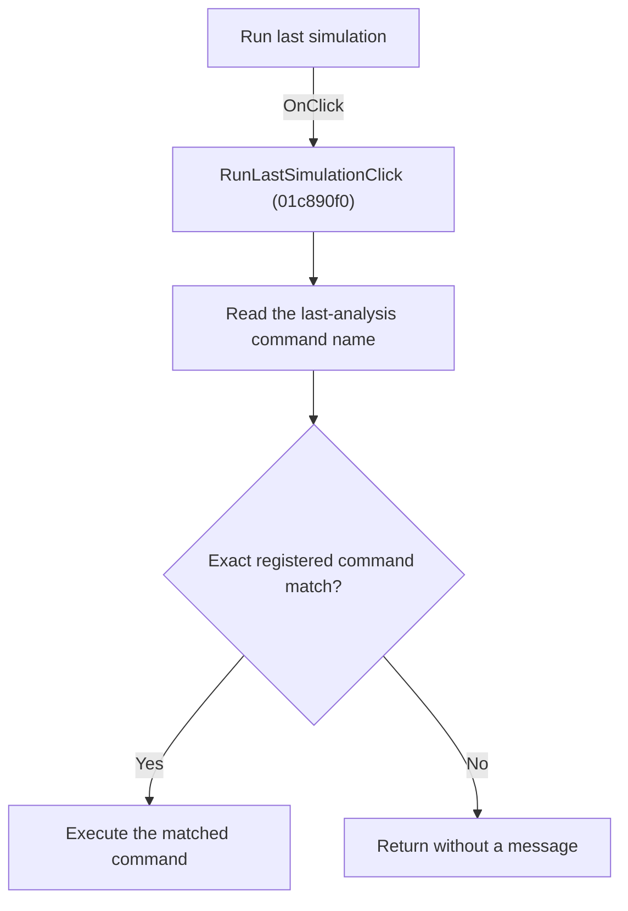

# Run last simulation

> Analysis status: Reviewed from recovered source and graph evidence.

## Control

| Property | Recovered value |
| --- | --- |
| Form | SchematicEditor |
| Component path | SchematicEditor.MainMenu.mnAnalysis.RunLastSimulation |
| Control class | TMenuItem |
| Caption | Run last simulation |
| Handler name | RunLastSimulationClick |
| Handler address | 01c890f0 |
| Graph node | `resource:dfm:SchematicEditor/SchematicEditor.MainMenu.mnAnalysis.RunLastSimulation` |
| Handler node | `function:01c890f0` |
| Graph layer | UI |

## What happens when clicked

Searches the registered command collection for the command name stored in the editor last-analysis field and executes the exact match. An empty field or no match is a silent no-op.

## Click flow

## Handler evidence

- Source: [DecompiledSources/Tina16/functions/0000000001C890F0__FUN_01c890f0.c](../../../DecompiledSources/Tina16/functions/0000000001C890F0__FUN_01c890f0.c)
- Recovered role: Run the last registered analysis command.
- Evidence: The handler forwards to FUN_01c7db90. That function reads SchematicEditor +0x27e8, enumerates the command collection, compares each command name with FUN_00416db0, and invokes the matching command with FUN_00557c30. Other analysis handlers write their own command names to +0x27e8.

## Application-relevant calls

- FUN_01c7db90 performs the lookup and command dispatch.

## Resource evidence

- The DFM binds this menu item to `RunLastSimulationClick`.
- The recovered caption is `Run last simulation`.
- No extracted glyph is associated with this control.

## Analysis limits

- The recovered names of some form fields and global state bytes are not available. This article identifies them by stable offsets and proven readers or writers where necessary.