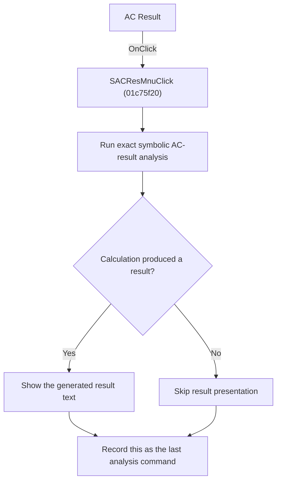

# AC Result

> Analysis status: Reviewed from recovered source and graph evidence.

## Control

| Property | Recovered value |
| --- | --- |
| Form | SchematicEditor |
| Component path | SchematicEditor.MainMenu.mnAnalysis.Symbolic1.SACResMnu |
| Control class | TMenuItem |
| Caption | AC Result |
| Handler name | SACResMnuClick |
| Handler address | 01c75f20 |
| Graph node | `resource:dfm:SchematicEditor/SchematicEditor.MainMenu.mnAnalysis.Symbolic1.SACResMnu` |
| Handler node | `function:01c75f20` |
| Graph layer | UI |

## What happens when clicked

Runs the exact symbolic AC-result calculation for the current circuit and registers this command as the last analysis command after the calculation returns.

## Click flow

## Handler evidence

- Source: [DecompiledSources/Tina16/functions/0000000001C75F20__FUN_01c75f20.c](../../../DecompiledSources/Tina16/functions/0000000001C75F20__FUN_01c75f20.c)
- Recovered role: Run exact symbolic AC-result analysis.
- Evidence: The handler calls FUN_0145ecb0 with mode 0 and SchematicEditor +0x2788. The callee uses mode 0 for the exact symbolic result path and presents generated result text when it is not aborted. The handler then writes SACResMnuClick to +0x27e8.

## Application-relevant calls

- FUN_0145ecb0 calculates and presents the AC result.

## Resource evidence

- The DFM binds this menu item to `SACResMnuClick`.
- The recovered caption is `AC Result`.
- No extracted glyph is associated with this control.

## Analysis limits

- The recovered names of some form fields and global state bytes are not available. This article identifies them by stable offsets and proven readers or writers where necessary.