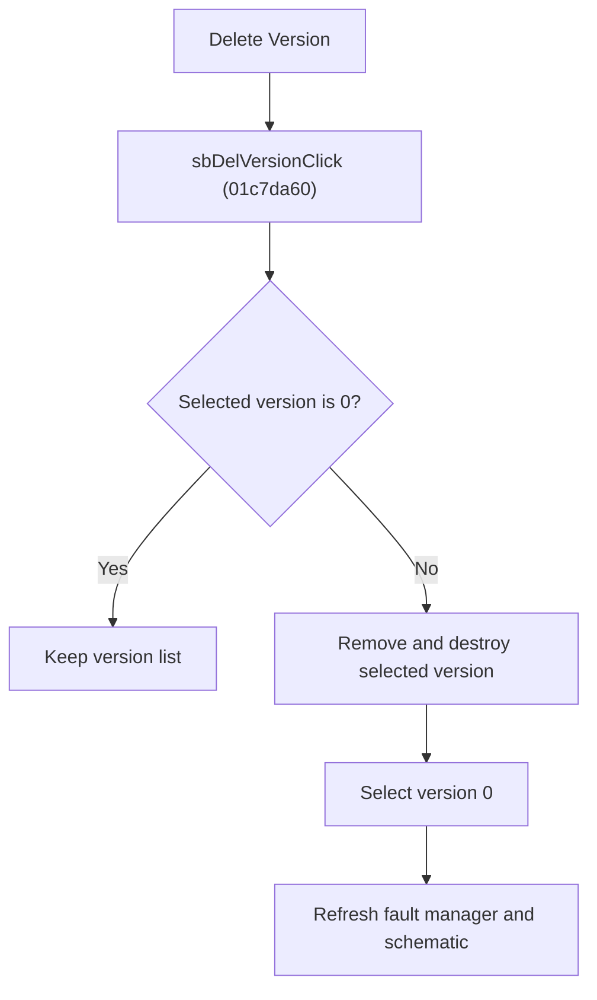

# Delete Version

> Analysis status: Reviewed from recovered source, model helper, resource text, and glyph evidence.

## Control

| Property | Recovered value |
| --- | --- |
| Component path | SchematicEditor.EditorPanel.FaultManager.GroupBox4.FaultPanel.sbDelVersion |
| Control class | TSpeedButton |
| Hint | Delete Version\|Deletes the current version of the circuit |
| Handler | sbDelVersionClick at 01c7da60 |

## What happens when clicked

The handler protects version `0`. For any other selected version, it removes and destroys the matching version record, compacts the version list, selects version `0`, and refreshes the fault-manager controls and schematic state.

## Click flow

## Handler evidence

- Source: [FUN_01c7da60](../../../DecompiledSources/Tina16/functions/0000000001C7DA60__FUN_01c7da60.c)
- [FUN_012bee60](../../../DecompiledSources/Tina16/functions/00000000012BEE60__FUN_012bee60.c) finds the version by its stored number, destroys it, removes it, and compacts the list.
- [FUN_01c7d780](../../../DecompiledSources/Tina16/functions/0000000001C7D780__FUN_01c7d780.c) selects the requested version and performs the dependent UI and model refresh.
- Extracted glyph: [Delete Version glyph](../../../glyph/0369_SchematicEditor_SchematicEditor_EditorPanel_FaultManager_GroupBox4_FaultPanel_sbDelVersion_Glyph_Data.png)

## No-op and error behavior

- Version `0`: no deletion and no refresh call from this handler.
- The recovered handler does not ask for confirmation.
