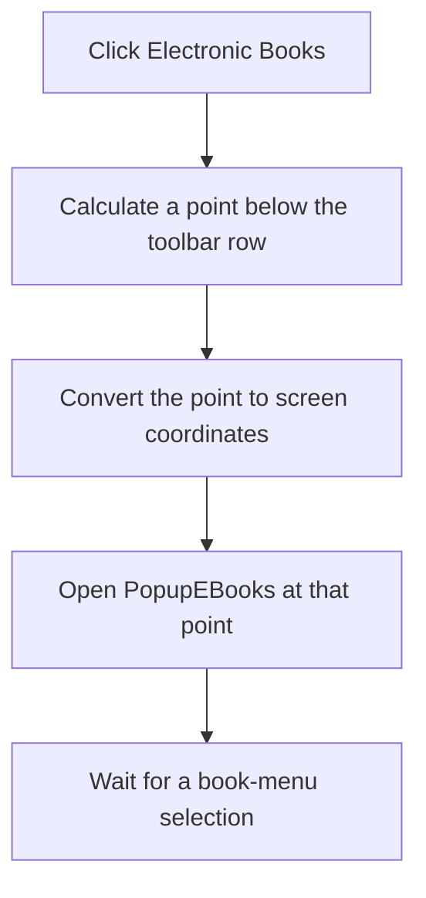

# Electronic Books

> Analysis status: Complete.

## Control

| Property | Recovered value |
| --- | --- |
| Form | SchematicEditor |
| Component path | SchematicEditor.TopToolBar.EditorTools.sbEBooks |
| Control class | TSpeedButton |
| Hint | Electronic Books |
| Handler | `sbEBooksClick` at `01ca2020` |
| Graph nodes | `resource:dfm:SchematicEditor/SchematicEditor.TopToolBar.EditorTools.sbEBooks` → `function:01ca2020` |
| Graph layer | UI |

## What happens when clicked

The handler prepares `SchematicEditor.PopupEBooks` for an explicit pop-up request. It calculates a point two pixels below the toolbar row, converts that point from the electronic-books control at `+0x1580` to screen coordinates, and opens the pop-up menu stored at `+0x1588`.

This click only opens the menu. It does not open a book until the user selects a pop-up item. The handler has no branch, message, retry, or local exception block.

## Click flow

## Evidence

- Handler: [FUN_01ca2020](../../../DecompiledSources/Tina16/functions/0000000001CA2020__FUN_01ca2020.c)
- Coordinate conversion: [FUN_0064d1f0](../../../DecompiledSources/Tina16/functions/000000000064D1F0__FUN_0064d1f0.c)
- Resource: `SchematicEditor.PopupEBooks`.
- Extracted glyph: [Electronic Books glyph](../../../glyph/0350_SchematicEditor_SchematicEditor_TopToolBar_EditorTools_sbEBooks_Glyph_Data.png)
- Recovered role: Open the Electronic Books pop-up below its toolbar control.

## Analysis limits

- The individual electronic-book entries are populated outside this recovered click handler.
