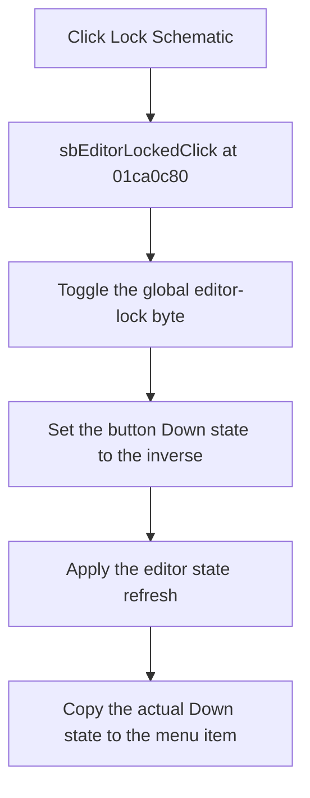

# Lock Schematic

> Analysis status: Complete.

## Control

| Property | Recovered value |
| --- | --- |
| Form | SchematicEditor |
| Component path | SchematicEditor.StatusPanel.ButtonPanel.EditorLockPanel.sbEditorLocked |
| Control class | TSpeedButton |
| Hint | Lock Schematic\|Locks/unlocks the schematic editor at the bottom |
| Handler | `sbEditorLockedClick` at `01ca0c80` |
| Graph nodes | `resource:dfm:SchematicEditor/SchematicEditor.StatusPanel.ButtonPanel.EditorLockPanel.sbEditorLocked` → `function:01ca0c80` |
| Graph layer | UI |

## What happens when clicked

The handler toggles global byte `DAT_01fe7778`. It sets the speed button at form offset `+0x1508` to the inverse of that byte, calls the editor state-refresh dispatch, and then copies the button's actual Down state to the related menu item at `+0xac8`.

The result is one lock-state change with synchronized button and menu feedback. `TMenuItem.SetChecked` does nothing when the menu state already matches. The handler has no rejection branch, message, retry, or local exception block.

## Click flow

## Evidence

- Handler: [FUN_01ca0c80](../../../DecompiledSources/Tina16/functions/0000000001CA0C80__FUN_01ca0c80.c)
- Menu synchronization: [FUN_007e2d20](../../../DecompiledSources/Tina16/functions/00000000007E2D20__FUN_007e2d20.c)
- Extracted glyph: [Editor lock glyph](../../../glyph/0376_SchematicEditor_SchematicEditor_StatusPanel_ButtonPanel_EditorLockPanel_sbEditorLocked_Glyph_Data.png)
- Recovered role: Toggle the Schematic Editor lock state and synchronize its controls.

## Analysis limits

- The exact Delphi names and polarity of the global byte are not recovered. The article states the observed inverse relation instead of assigning an unsupported field name.
