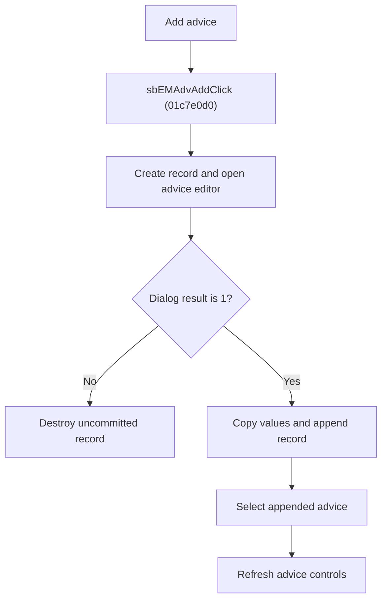

# Add Advice

> Analysis status: Reviewed from recovered source, dialog helpers, resource text, and glyph evidence.

## Control

| Property | Recovered value |
| --- | --- |
| Component path | SchematicEditor.EditorPanel.FaultManager.nbExMan.tsExManAdvisor.GroupBox6.sbEMAdvAdd |
| Control class | TSpeedButton |
| Hint | Add\|Add a new advice to the end |
| Handler | sbEMAdvAddClick at 01c7e0d0 |

## What happens when clicked

The handler creates a new advice record and opens the advice editor with the next one-based advice number. If the dialog returns modal result `1`, it copies the penalty and advice lines to the record, appends the record to the current version's advice list, selects the appended index, and refreshes the advice controls. Cancel destroys the uncommitted record. The dialog is destroyed on both paths.

## Click flow

## Handler evidence

- Source: [FUN_01c7e0d0](../../../DecompiledSources/Tina16/functions/0000000001C7E0D0__FUN_01c7e0d0.c)
- `FUN_012bdec0` creates the advice record. `FUN_004ae7e0` appends it and returns its index.
- [FUN_01b72750](../../../DecompiledSources/Tina16/functions/0000000001B72750__FUN_01b72750.c) initializes the dialog. [FUN_01b72860](../../../DecompiledSources/Tina16/functions/0000000001B72860__FUN_01b72860.c) reads its penalty and advice lines.
- [FUN_01c7e2a0](../../../DecompiledSources/Tina16/functions/0000000001C7E2A0__FUN_01c7e2a0.c) refreshes the current/total text, penalty, advice text, and button states.
- Extracted glyph: [Add glyph](../../../glyph/0372_SchematicEditor_SchematicEditor_EditorPanel_FaultManager_nbExMan_tsExManAdvisor_GroupBox6_sbEMAdvAdd_Glyph_Data.png)

## No-op and error behavior

- Cancel: no record is appended.
- The recovered handler has no separate error dialog.
