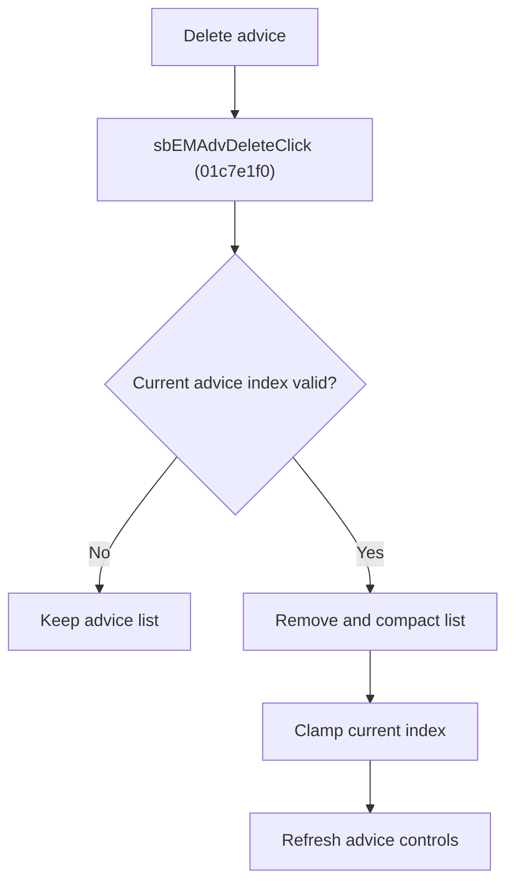

# Delete Advice

> Analysis status: Reviewed from recovered source, list helpers, resource text, and glyph evidence.

## Control

| Property | Recovered value |
| --- | --- |
| Component path | SchematicEditor.EditorPanel.FaultManager.nbExMan.tsExManAdvisor.GroupBox6.sbEMAdvDelete |
| Control class | TSpeedButton |
| Hint | Delete\|Delete current advice |
| Handler | sbEMAdvDeleteClick at 01c7e1f0 |

## What happens when clicked

The handler deletes the current advice only when its index is valid. It removes the list entry, compacts the list, clamps the current index to the new last item when necessary, and refreshes the advice display and button states. It does not show a confirmation dialog.

## Click flow

## Handler evidence

- Source: [FUN_01c7e1f0](../../../DecompiledSources/Tina16/functions/0000000001C7E1F0__FUN_01c7e1f0.c)
- `FUN_004ae870` removes the current entry and `FUN_004aee80` compacts the list.
- [FUN_01c7e2a0](../../../DecompiledSources/Tina16/functions/0000000001C7E2A0__FUN_01c7e2a0.c) refreshes text and button state.
- Extracted glyph: [Delete glyph](../../../glyph/0375_SchematicEditor_SchematicEditor_EditorPanel_FaultManager_nbExMan_tsExManAdvisor_GroupBox6_sbEMAdvDelete_Glyph_Data.png)

## No-op and error behavior

- Invalid or absent current index: no list change.
- No confirmation or separate error path is present.
