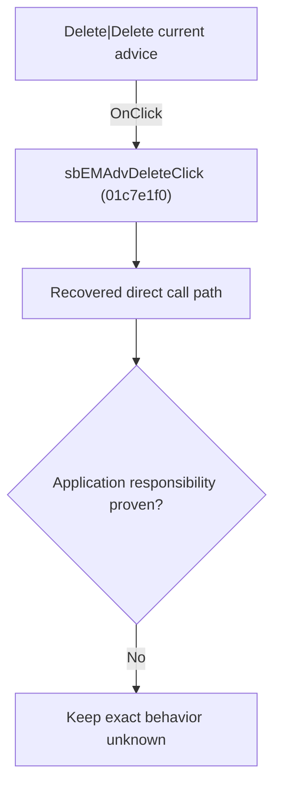

# Delete|Delete current advice

> Analysis status: Blocked by an exact evidence gap.

## Control

| Property | Recovered value |
| --- | --- |
| Form | SchematicEditor |
| Component path | SchematicEditor.EditorPanel.FaultManager.nbExMan.tsExManAdvisor.GroupBox6.sbEMAdvDelete |
| Control class | TSpeedButton |
| Caption | Not present in the recovered resource. |
| Hint | Delete\|Delete current advice |
| Text | Not present in the recovered resource. |
| Handler name | sbEMAdvDeleteClick |
| Handler address | 01c7e1f0 |
| Graph node | `resource:dfm:SchematicEditor/SchematicEditor.EditorPanel.FaultManager.nbExMan.tsExManAdvisor.GroupBox6.sbEMAdvDelete` |
| Handler node | `function:01c7e1f0` |
| Graph layer | UI |

## What happens when clicked

The OnClick binding reaches sbEMAdvDeleteClick at 01c7e1f0. The recovered body has 4 distinct outgoing graph call(s), but the application-specific responsibilities and data effects of its downstream path are not established in the accepted graph evidence. The control's caption or name indicates user intent only; it is not enough to claim implementation behavior.

## Click flow

## Handler evidence

- Source: [DecompiledSources/Tina16/functions/0000000001C7E1F0__FUN_01c7e1f0.c](../../../DecompiledSources/Tina16/functions/0000000001C7E1F0__FUN_01c7e1f0.c)
- Recovered role: Evidence-blocked sbEMAdvDeleteClick command.
- Current graph summary: Handles 1 Delphi UI event: SchematicEditor.EditorPanel.FaultManager.nbExMan.tsExManAdvisor.GroupBox6.sbEMAdvDelete.OnClick.
- Current graph behavior: The OnClick binding reaches sbEMAdvDeleteClick at 01c7e1f0. The recovered body has 4 distinct outgoing graph call(s), but the application-specific responsibilities and data effects of its downstream path are not established in the accepted graph evidence. The control's caption or name indicates user intent only; it is not enough to claim implementation behavior.
- Current graph evidence: The DFM binds SchematicEditor.EditorPanel.FaultManager.nbExMan.tsExManAdvisor.GroupBox6.sbEMAdvDelete to sbEMAdvDeleteClick. The recovered source is DecompiledSources/Tina16/functions/0000000001C7E1F0__FUN_01c7e1f0.c and directly references 004ae870, 004aee80, 01c7d9d0, 01c7e2a0. No accepted end-to-end role was established for this control path.
- Complexity: complex
- Distinct outgoing calls: 4

## Direct calls

- `function:004ae870` — FUN_004ae870
- `function:004aee80` — FUN_004aee80
- `function:01c7d9d0` — FUN_01c7d9d0
- `function:01c7e2a0` — FUN_01c7e2a0

## Resource evidence

- Kind: Not present in the recovered resource.
- Modal result: Not present in the recovered resource.
- Checked state: Not present in the recovered resource.
- List items: Not present in the recovered resource.
- Image reference: Not present in the recovered resource.
- Extracted glyph: [`0375_SchematicEditor_SchematicEditor_EditorPanel_FaultManager_nbExMan_tsExManAdvisor_GroupBox6_sbEMAdvDelete_Glyph_Data.png`](../../../glyph/0375_SchematicEditor_SchematicEditor_EditorPanel_FaultManager_nbExMan_tsExManAdvisor_GroupBox6_sbEMAdvDelete_Glyph_Data.png)

## Nearby label candidates

Nearby labels are layout candidates only. They are not proof of behavior.

- Rank 1: 99/99 at distance 151.
- Rank 2: Penalty [%]: at distance 232.

## Analysis limits

- Exact gap: the recovered handler or one of its direct application callees lacks a source-supported role that proves the command's decisions, state changes, and output. Keep this Bead open until those callees are traced.

