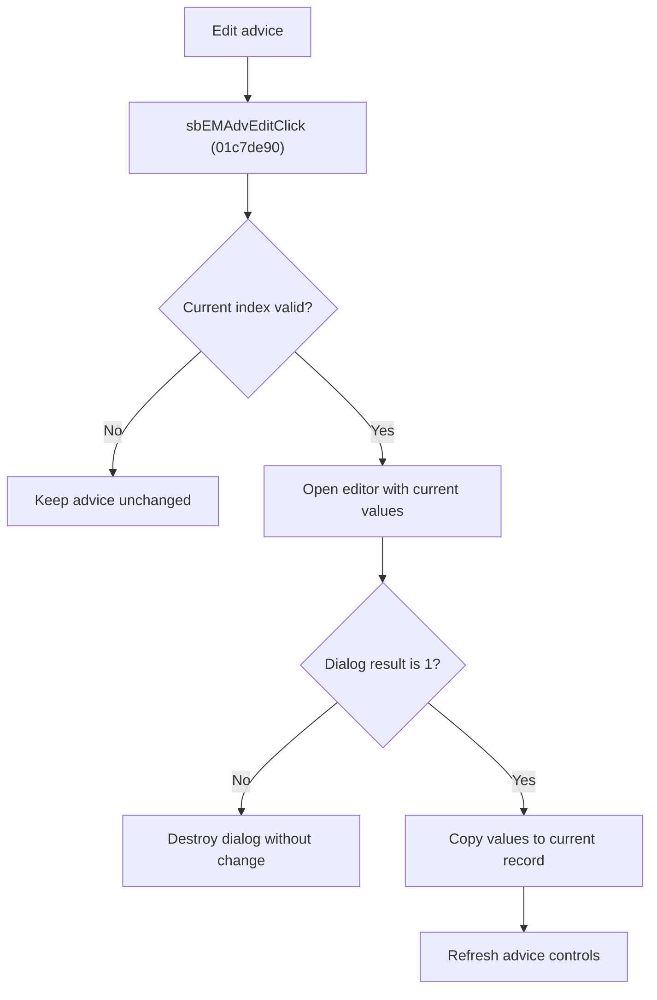

# Edit Advice

> Analysis status: Reviewed from recovered source, dialog helpers, resource text, and glyph evidence.

## Control

| Property | Recovered value |
| --- | --- |
| Component path | SchematicEditor.EditorPanel.FaultManager.nbExMan.tsExManAdvisor.GroupBox6.sbEMAdvEdit |
| Control class | TSpeedButton |
| Hint | Edit\|Edit this advice |
| Handler | sbEMAdvEditClick at 01c7de90 |

## What happens when clicked

For a valid current advice index, the handler opens the advice editor with the existing one-based number, penalty, and advice lines. Modal result `1` copies the edited penalty and lines back to the same record and refreshes the controls. Cancel leaves the record unchanged. The dialog is destroyed on both paths.

## Click flow

## Handler evidence

- Source: [FUN_01c7de90](../../../DecompiledSources/Tina16/functions/0000000001C7DE90__FUN_01c7de90.c)
- [FUN_01b72750](../../../DecompiledSources/Tina16/functions/0000000001B72750__FUN_01b72750.c) loads the record into the dialog.
- [FUN_01b72860](../../../DecompiledSources/Tina16/functions/0000000001B72860__FUN_01b72860.c) parses the penalty and copies the advice lines back after acceptance.
- Extracted glyph: [Edit glyph](../../../glyph/0370_SchematicEditor_SchematicEditor_EditorPanel_FaultManager_nbExMan_tsExManAdvisor_GroupBox6_sbEMAdvEdit_Glyph_Data.png)

## No-op and error behavior

- Invalid index or Cancel: the record stays unchanged.
- The recovered handler has no separate error branch outside the dialog.
