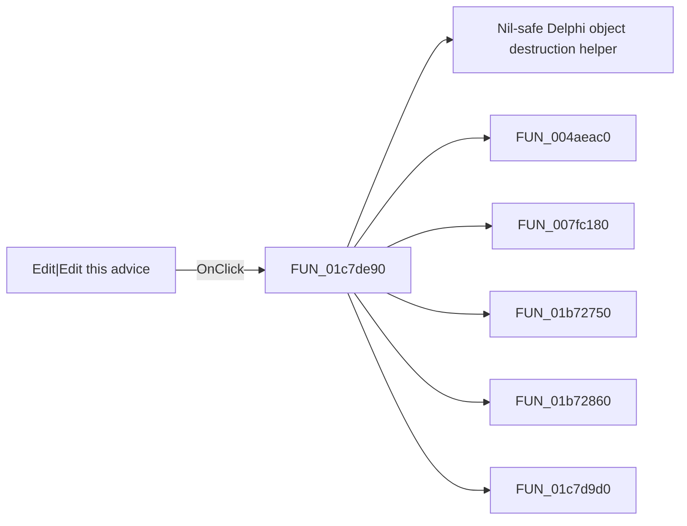

# Edit|Edit this advice

> Analysis status: Pending individual source review.

## Control

| Property | Recovered value |
| --- | --- |
| Form | SchematicEditor |
| Component path | SchematicEditor.EditorPanel.FaultManager.nbExMan.tsExManAdvisor.GroupBox6.sbEMAdvEdit |
| Control class | TSpeedButton |
| Caption | Not present in the recovered resource. |
| Hint | Edit\|Edit this advice |
| Text | Not present in the recovered resource. |
| Handler name | sbEMAdvEditClick |
| Handler address | 01c7de90 |
| Graph node | `resource:dfm:SchematicEditor/SchematicEditor.EditorPanel.FaultManager.nbExMan.tsExManAdvisor.GroupBox6.sbEMAdvEdit` |
| Handler node | `function:01c7de90` |
| Graph layer | UI |

## What happens when clicked

Pending individual analysis. An agent must read the recovered handler source and its relevant callees before it replaces this text.

## Click flow

## Handler evidence

- Source: [DecompiledSources/Tina16/functions/0000000001C7DE90__FUN_01c7de90.c](../../../DecompiledSources/Tina16/functions/0000000001C7DE90__FUN_01c7de90.c)
- Recovered role: Not present in the recovered resource.
- Current graph summary: Handles 1 Delphi UI event: SchematicEditor.EditorPanel.FaultManager.nbExMan.tsExManAdvisor.GroupBox6.sbEMAdvEdit.OnClick.
- Current graph behavior: Not present in the recovered resource.
- Current graph evidence: Not present in the recovered resource.
- Complexity: complex
- Distinct outgoing calls: 7

## Direct calls

- `function:00410f20` — Nil-safe Delphi object destruction helper
- `function:004aeac0` — FUN_004aeac0
- `function:007fc180` — FUN_007fc180
- `function:01b72750` — FUN_01b72750
- `function:01b72860` — FUN_01b72860
- `function:01c7d9d0` — FUN_01c7d9d0
- `function:01c7e2a0` — FUN_01c7e2a0

## Resource evidence

- Kind: Not present in the recovered resource.
- Modal result: Not present in the recovered resource.
- Checked state: Not present in the recovered resource.
- List items: Not present in the recovered resource.
- Image reference: Not present in the recovered resource.
- Extracted glyph: [`0370_SchematicEditor_SchematicEditor_EditorPanel_FaultManager_nbExMan_tsExManAdvisor_GroupBox6_sbEMAdvEdit_Glyph_Data.png`](../../../glyph/0370_SchematicEditor_SchematicEditor_EditorPanel_FaultManager_nbExMan_tsExManAdvisor_GroupBox6_sbEMAdvEdit_Glyph_Data.png)

## Nearby label candidates

Nearby labels are layout candidates only. They are not proof of behavior.

- Rank 1: Penalty [%]: at distance 155.
- Rank 2: 99/99 at distance 228.

## Analysis limits

- Do not infer behavior from the control class, caption, hint, glyph, or nearby label alone.
- Do not replace the pending status until the handler source and relevant call path provide enough evidence.
