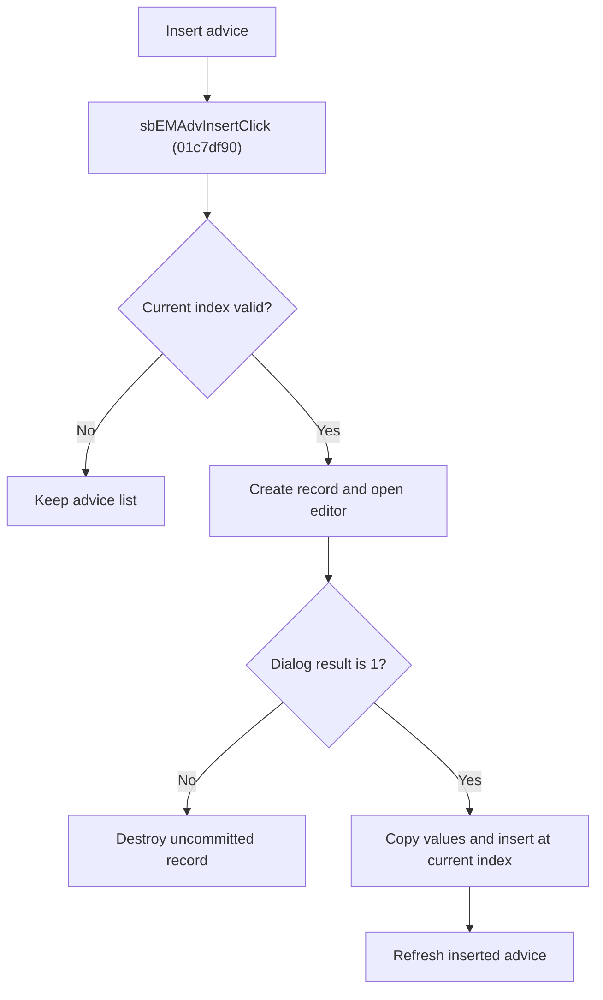

# Insert Advice

> Analysis status: Reviewed from recovered source, dialog helpers, resource text, and glyph evidence.

## Control

| Property | Recovered value |
| --- | --- |
| Component path | SchematicEditor.EditorPanel.FaultManager.nbExMan.tsExManAdvisor.GroupBox6.sbEMAdvInsert |
| Control class | TSpeedButton |
| Hint | Insert\|Insert a new advice before the current advice |
| Handler | sbEMAdvInsertClick at 01c7df90 |

## What happens when clicked

For a valid current index, the handler creates a new advice record and opens the editor with the current one-based position. Modal result `1` copies the penalty and advice lines into the new record, inserts it before the former current record, and refreshes the controls. Because the index is unchanged, it now selects the inserted record. Cancel destroys the uncommitted record.

## Click flow

## Handler evidence

- Source: [FUN_01c7df90](../../../DecompiledSources/Tina16/functions/0000000001C7DF90__FUN_01c7df90.c)
- `FUN_012bdec0` creates the record and `FUN_004aec30` inserts it at the current index.
- `FUN_01b72750` initializes the editor; `FUN_01b72860` reads its accepted values.
- Extracted glyph: [Insert glyph](../../../glyph/0373_SchematicEditor_SchematicEditor_EditorPanel_FaultManager_nbExMan_tsExManAdvisor_GroupBox6_sbEMAdvInsert_Glyph_Data.png)

## No-op and error behavior

- Invalid index or Cancel: no record is inserted.
- The recovered handler has no separate error dialog.
