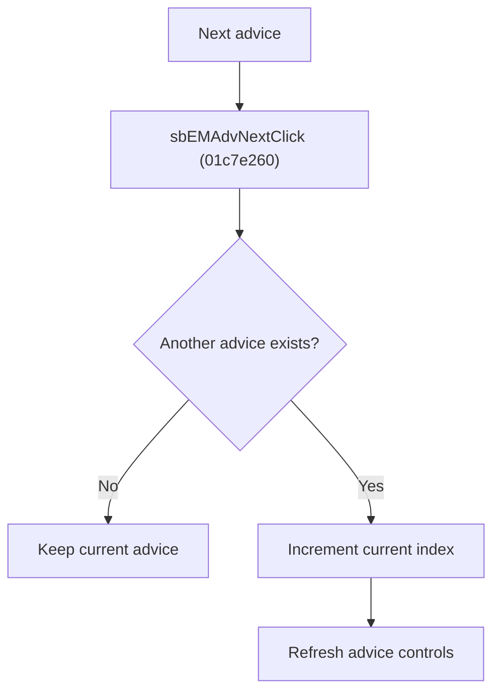

# Next Advice

> Analysis status: Reviewed from recovered source, refresh helper, resource text, and glyph evidence.

## Control

| Property | Recovered value |
| --- | --- |
| Component path | SchematicEditor.EditorPanel.FaultManager.nbExMan.tsExManAdvisor.GroupBox6.sbEMAdvNext |
| Control class | TSpeedButton |
| Hint | Next\|Move to next advice |
| Handler | sbEMAdvNextClick at 01c7e260 |

## What happens when clicked

The handler moves to the next expert-manager advice when another record exists. It increments the current advice index and refreshes the displayed current/total position, penalty, advice text, and navigation and edit button states.

## Click flow

## Handler evidence

- Source: [FUN_01c7e260](../../../DecompiledSources/Tina16/functions/0000000001C7E260__FUN_01c7e260.c)
- The handler compares the current index with the advice-list count before it increments the index.
- [FUN_01c7e2a0](../../../DecompiledSources/Tina16/functions/0000000001C7E2A0__FUN_01c7e2a0.c) performs the UI refresh.
- Extracted glyph: [Next glyph](../../../glyph/0374_SchematicEditor_SchematicEditor_EditorPanel_FaultManager_nbExMan_tsExManAdvisor_GroupBox6_sbEMAdvNext_Glyph_Data.png)

## No-op and error behavior

- Last advice or empty list: no state change.
- The recovered handler has no error branch.
