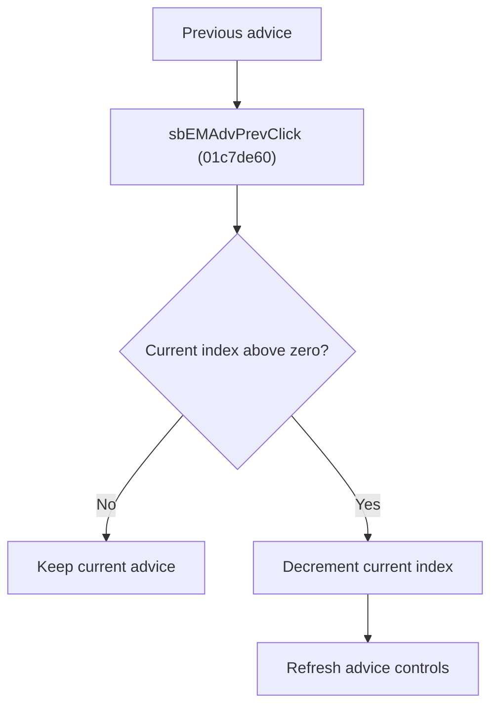

# Previous Advice

> Analysis status: Reviewed from recovered source, refresh helper, resource text, and glyph evidence.

## Control

| Property | Recovered value |
| --- | --- |
| Component path | SchematicEditor.EditorPanel.FaultManager.nbExMan.tsExManAdvisor.GroupBox6.sbEMAdvPrev |
| Control class | TSpeedButton |
| Hint | Previous\|Move to previous advice |
| Handler | sbEMAdvPrevClick at 01c7de60 |

## What happens when clicked

The handler moves to the previous expert-manager advice when the current index is greater than zero. It decrements the index and refreshes the displayed current/total position, penalty, advice text, and navigation and edit button states.

## Click flow

## Handler evidence

- Source: [FUN_01c7de60](../../../DecompiledSources/Tina16/functions/0000000001C7DE60__FUN_01c7de60.c)
- The recovered handler tests the current index before decrementing it.
- [FUN_01c7e2a0](../../../DecompiledSources/Tina16/functions/0000000001C7E2A0__FUN_01c7e2a0.c) performs the UI refresh.
- Extracted glyph: [Previous glyph](../../../glyph/0371_SchematicEditor_SchematicEditor_EditorPanel_FaultManager_nbExMan_tsExManAdvisor_GroupBox6_sbEMAdvPrev_Glyph_Data.png)

## No-op and error behavior

- First advice or empty list: no state change.
- The recovered handler has no error branch.
