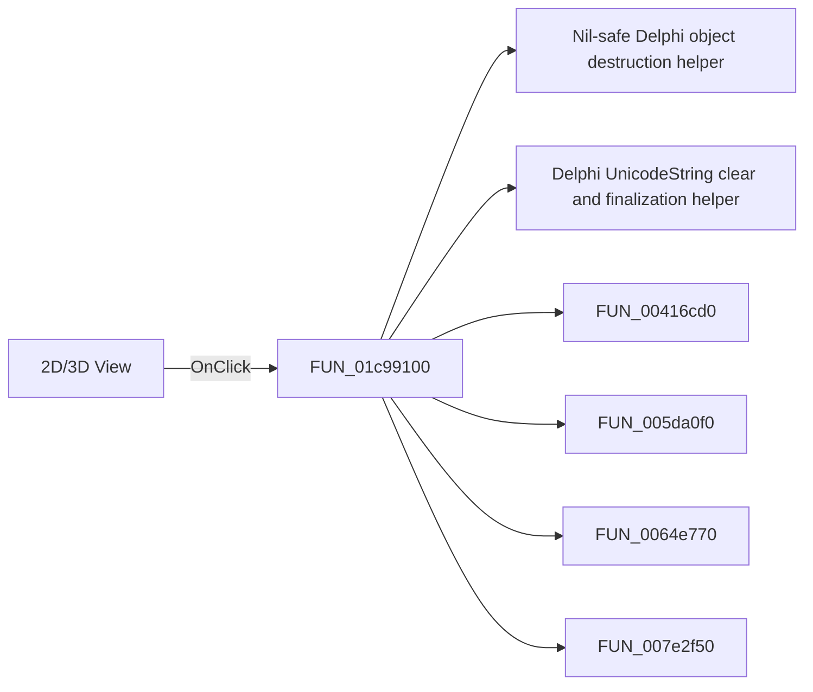

# 2D/3D View

> Analysis status: Pending individual source review.

## Control

| Property | Recovered value |
| --- | --- |
| Form | SchematicEditor |
| Component path | SchematicEditor.TopToolBar.EditorTools.sbEnable3DView |
| Control class | TSpeedButton |
| Caption | Not present in the recovered resource. |
| Hint | 2D/3D View |
| Text | Not present in the recovered resource. |
| Handler name | sbEnable3DViewClick |
| Handler address | 01c99100 |
| Graph node | `resource:dfm:SchematicEditor/SchematicEditor.TopToolBar.EditorTools.sbEnable3DView` |
| Handler node | `function:01c99100` |
| Graph layer | UI |

## What happens when clicked

Pending individual analysis. An agent must read the recovered handler source and its relevant callees before it replaces this text.

## Click flow

## Handler evidence

- Source: [DecompiledSources/Tina16/functions/0000000001C99100__FUN_01c99100.c](../../../DecompiledSources/Tina16/functions/0000000001C99100__FUN_01c99100.c)
- Recovered role: Not present in the recovered resource.
- Current graph summary: Handles 1 Delphi UI event: SchematicEditor.TopToolBar.EditorTools.sbEnable3DView.OnClick.
- Current graph behavior: Not present in the recovered resource.
- Current graph evidence: Not present in the recovered resource.
- Complexity: complex
- Distinct outgoing calls: 7

## Direct calls

- `function:00410f20` — Nil-safe Delphi object destruction helper
- `function:00414480` — Delphi UnicodeString clear and finalization helper
- `function:00416cd0` — FUN_00416cd0
- `function:005da0f0` — FUN_005da0f0
- `function:0064e770` — FUN_0064e770
- `function:007e2f50` — FUN_007e2f50
- `function:007e2f80` — FUN_007e2f80

## Resource evidence

- Kind: Not present in the recovered resource.
- Modal result: Not present in the recovered resource.
- Checked state: Not present in the recovered resource.
- List items: Not present in the recovered resource.
- Image reference: Not present in the recovered resource.
- Extracted glyph: [`0346_SchematicEditor_SchematicEditor_TopToolBar_EditorTools_sbEnable3DView_Glyph_Data.png`](../../../glyph/0346_SchematicEditor_SchematicEditor_TopToolBar_EditorTools_sbEnable3DView_Glyph_Data.png)

## Nearby label candidates

Nearby labels are layout candidates only. They are not proof of behavior.

- No same-parent label candidate is available.

## Analysis limits

- Do not infer behavior from the control class, caption, hint, glyph, or nearby label alone.
- Do not replace the pending status until the handler source and relevant call path provide enough evidence.
