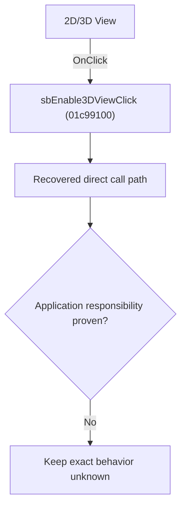

# 2D/3D View

> Analysis status: Blocked by an exact evidence gap.

## Control

| Property | Recovered value |
| --- | --- |
| Form | SchematicEditor |
| Component path | SchematicEditor.TopToolBar.EditorTools.sbEnable3DView |
| Control class | TSpeedButton |
| Caption | Not present in the recovered resource. |
| Hint | 2D/3D View |
| Text | Not present in the recovered resource. |
| Handler name | sbEnable3DViewClick |
| Handler address | 01c99100 |
| Graph node | `resource:dfm:SchematicEditor/SchematicEditor.TopToolBar.EditorTools.sbEnable3DView` |
| Handler node | `function:01c99100` |
| Graph layer | UI |

## What happens when clicked

The OnClick binding reaches sbEnable3DViewClick at 01c99100. The recovered body has 7 distinct outgoing graph call(s), but the application-specific responsibilities and data effects of its downstream path are not established in the accepted graph evidence. The control's caption or name indicates user intent only; it is not enough to claim implementation behavior.

## Click flow

## Handler evidence

- Source: [DecompiledSources/Tina16/functions/0000000001C99100__FUN_01c99100.c](../../../DecompiledSources/Tina16/functions/0000000001C99100__FUN_01c99100.c)
- Recovered role: Evidence-blocked sbEnable3DViewClick command.
- Current graph summary: Handles 1 Delphi UI event: SchematicEditor.TopToolBar.EditorTools.sbEnable3DView.OnClick.
- Current graph behavior: The OnClick binding reaches sbEnable3DViewClick at 01c99100. The recovered body has 7 distinct outgoing graph call(s), but the application-specific responsibilities and data effects of its downstream path are not established in the accepted graph evidence. The control's caption or name indicates user intent only; it is not enough to claim implementation behavior.
- Current graph evidence: The DFM binds SchematicEditor.TopToolBar.EditorTools.sbEnable3DView to sbEnable3DViewClick. The recovered source is DecompiledSources/Tina16/functions/0000000001C99100__FUN_01c99100.c and directly references 00410f20, 00414480, 00416cd0, 005da0f0, 0064e770, 007e2f50, 007e2f80. No accepted end-to-end role was established for this control path.
- Complexity: complex
- Distinct outgoing calls: 7

## Direct calls

- `function:00410f20` — Nil-safe Delphi object destruction helper
- `function:00414480` — Delphi UnicodeString clear and finalization helper
- `function:00416cd0` — FUN_00416cd0
- `function:005da0f0` — FUN_005da0f0
- `function:0064e770` — FUN_0064e770
- `function:007e2f50` — FUN_007e2f50
- `function:007e2f80` — FUN_007e2f80

## Resource evidence

- Kind: Not present in the recovered resource.
- Modal result: Not present in the recovered resource.
- Checked state: Not present in the recovered resource.
- List items: Not present in the recovered resource.
- Image reference: Not present in the recovered resource.
- Extracted glyph: [`0346_SchematicEditor_SchematicEditor_TopToolBar_EditorTools_sbEnable3DView_Glyph_Data.png`](../../../glyph/0346_SchematicEditor_SchematicEditor_TopToolBar_EditorTools_sbEnable3DView_Glyph_Data.png)

## Nearby label candidates

Nearby labels are layout candidates only. They are not proof of behavior.

- No same-parent label candidate is available.

## Analysis limits

- Exact gap: the recovered handler or one of its direct application callees lacks a source-supported role that proves the command's decisions, state changes, and output. Keep this Bead open until those callees are traced.

