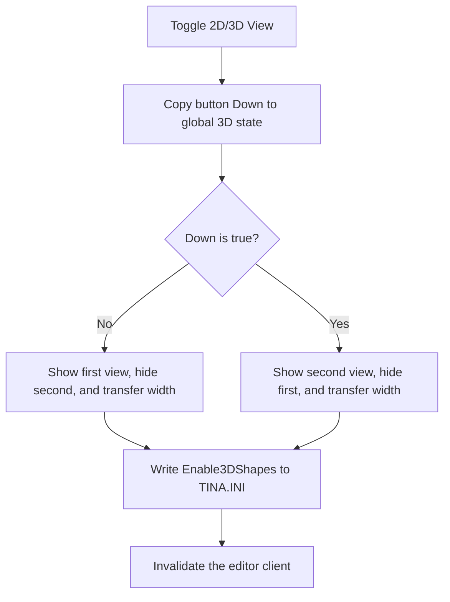

# 2D/3D View

> Analysis status: Complete.

## Control

| Property | Recovered value |
| --- | --- |
| Form | SchematicEditor |
| Component path | SchematicEditor.TopToolBar.EditorTools.sbEnable3DView |
| Control class | TSpeedButton |
| Hint | 2D/3D View |
| Handler | `sbEnable3DViewClick` at `01c99100` |
| Graph nodes | `resource:dfm:SchematicEditor/SchematicEditor.TopToolBar.EditorTools.sbEnable3DView` → `function:01c99100` |
| Graph layer | UI |

## What happens when clicked

The handler copies the button's Down state to a global 3D-view byte. If Down is false, it shows the view at `+0x1270`, hides the view at `+0x1278`, moves the second view's width to the first view, and sets the hidden view width to zero. If Down is true, it performs the inverse swap.

It then opens `TINA.INI`, writes the same Boolean value to section `Schematic Editor`, key `Enable3DShapes`, destroys the INI object, and invalidates the editor client at `+0xa10`. Thus, the display changes immediately and the selection persists for the next session.

The handler has no retry, message, rollback, or local exception block. A write or object-construction failure is not handled locally.

## Click flow

## Evidence

- Handler: [FUN_01c99100](../../../DecompiledSources/Tina16/functions/0000000001C99100__FUN_01c99100.c)
- Visibility setter: [FUN_007e2f80](../../../DecompiledSources/Tina16/functions/00000000007E2F80__FUN_007e2f80.c)
- Width setter: [FUN_007e2f50](../../../DecompiledSources/Tina16/functions/00000000007E2F50__FUN_007e2f50.c)
- Extracted glyph: [2D/3D view glyph](../../../glyph/0346_SchematicEditor_SchematicEditor_TopToolBar_EditorTools_sbEnable3DView_Glyph_Data.png)
- Recovered role: Switch the editor between its two display controls and persist `Enable3DShapes`.

## Analysis limits

- The original Delphi names of the two view fields at `+0x1270` and `+0x1278` are not recovered.
