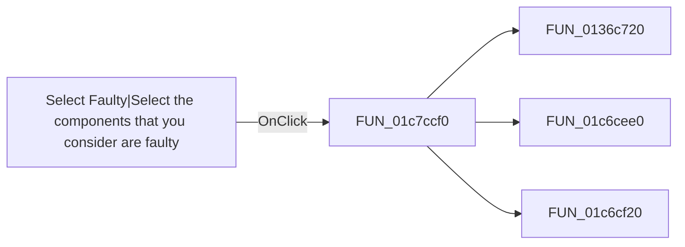

# Select Faulty|Select the components that you consider are faulty

> Analysis status: Pending individual source review.

## Control

| Property | Recovered value |
| --- | --- |
| Form | SchematicEditor |
| Component path | SchematicEditor.EditorPanel.ExamPanel.ExamMainPages.tsCurTask.GroupBox2.SolPages.tsFault.sbERFaulty |
| Control class | TSpeedButton |
| Caption | Not present in the recovered resource. |
| Hint | Select Faulty\|Select the components that you consider are faulty |
| Text | Not present in the recovered resource. |
| Handler name | sbERFaultyClick |
| Handler address | 01c7ccf0 |
| Graph node | `resource:dfm:SchematicEditor/SchematicEditor.EditorPanel.ExamPanel.ExamMainPages.tsCurTask.GroupBox2.SolPages.tsFault.sbERFaulty` |
| Handler node | `function:01c7ccf0` |
| Graph layer | UI |

## What happens when clicked

Pending individual analysis. An agent must read the recovered handler source and its relevant callees before it replaces this text.

## Click flow

## Handler evidence

- Source: [DecompiledSources/Tina16/functions/0000000001C7CCF0__FUN_01c7ccf0.c](../../../DecompiledSources/Tina16/functions/0000000001C7CCF0__FUN_01c7ccf0.c)
- Recovered role: Not present in the recovered resource.
- Current graph summary: Handles 1 Delphi UI event: SchematicEditor.EditorPanel.ExamPanel.ExamMainPages.tsCurTask.GroupBox2.SolPages.tsFault.sbERFaulty.OnClick.
- Current graph behavior: Not present in the recovered resource.
- Current graph evidence: Not present in the recovered resource.
- Complexity: complex
- Distinct outgoing calls: 3

## Direct calls

- `function:0136c720` — FUN_0136c720
- `function:01c6cee0` — FUN_01c6cee0
- `function:01c6cf20` — FUN_01c6cf20

## Resource evidence

- Kind: Not present in the recovered resource.
- Modal result: Not present in the recovered resource.
- Checked state: Not present in the recovered resource.
- List items: Not present in the recovered resource.
- Image reference: Not present in the recovered resource.
- Extracted glyph: [`0362_SchematicEditor_SchematicEditor_EditorPanel_ExamPanel_ExamMainPages_tsCurTask_GroupBox2_SolPages_tsFault_sbERFau_Glyph_Data.png`](../../../glyph/0362_SchematicEditor_SchematicEditor_EditorPanel_ExamPanel_ExamMainPages_tsCurTask_GroupBox2_SolPages_tsFault_sbERFau_Glyph_Data.png)

## Nearby label candidates

Nearby labels are layout candidates only. They are not proof of behavior.

- Rank 1: Please select the faulty  component(s). at distance 40.

## Analysis limits

- Do not infer behavior from the control class, caption, hint, glyph, or nearby label alone.
- Do not replace the pending status until the handler source and relevant call path provide enough evidence.
