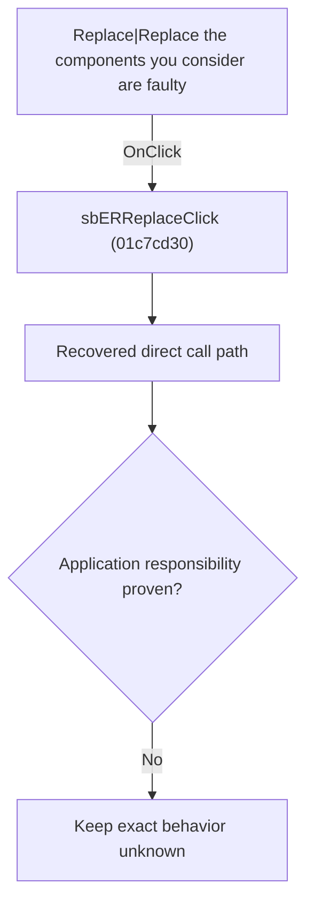

# Replace|Replace the components you consider are faulty

> Analysis status: Blocked by an exact evidence gap.

## Control

| Property | Recovered value |
| --- | --- |
| Form | SchematicEditor |
| Component path | SchematicEditor.EditorPanel.ExamPanel.ExamMainPages.tsCurTask.GroupBox2.SolPages.tsFault.sbERReplace |
| Control class | TSpeedButton |
| Caption | Not present in the recovered resource. |
| Hint | Replace\|Replace the components you consider are faulty |
| Text | Not present in the recovered resource. |
| Handler name | sbERReplaceClick |
| Handler address | 01c7cd30 |
| Graph node | `resource:dfm:SchematicEditor/SchematicEditor.EditorPanel.ExamPanel.ExamMainPages.tsCurTask.GroupBox2.SolPages.tsFault.sbERReplace` |
| Handler node | `function:01c7cd30` |
| Graph layer | UI |

## What happens when clicked

The OnClick binding reaches sbERReplaceClick at 01c7cd30. The recovered body has 3 distinct outgoing graph call(s), but the application-specific responsibilities and data effects of its downstream path are not established in the accepted graph evidence. The control's caption or name indicates user intent only; it is not enough to claim implementation behavior.

## Click flow

## Handler evidence

- Source: [DecompiledSources/Tina16/functions/0000000001C7CD30__FUN_01c7cd30.c](../../../DecompiledSources/Tina16/functions/0000000001C7CD30__FUN_01c7cd30.c)
- Recovered role: Evidence-blocked sbERReplaceClick command.
- Current graph summary: Handles 1 Delphi UI event: SchematicEditor.EditorPanel.ExamPanel.ExamMainPages.tsCurTask.GroupBox2.SolPages.tsFault.sbERReplace.OnClick.
- Current graph behavior: The OnClick binding reaches sbERReplaceClick at 01c7cd30. The recovered body has 3 distinct outgoing graph call(s), but the application-specific responsibilities and data effects of its downstream path are not established in the accepted graph evidence. The control's caption or name indicates user intent only; it is not enough to claim implementation behavior.
- Current graph evidence: The DFM binds SchematicEditor.EditorPanel.ExamPanel.ExamMainPages.tsCurTask.GroupBox2.SolPages.tsFault.sbERReplace to sbERReplaceClick. The recovered source is DecompiledSources/Tina16/functions/0000000001C7CD30__FUN_01c7cd30.c and directly references 0136c720, 01c6cee0, 01c6cf20. No accepted end-to-end role was established for this control path.
- Complexity: complex
- Distinct outgoing calls: 3

## Direct calls

- `function:0136c720` — FUN_0136c720
- `function:01c6cee0` — FUN_01c6cee0
- `function:01c6cf20` — FUN_01c6cf20

## Resource evidence

- Kind: Not present in the recovered resource.
- Modal result: Not present in the recovered resource.
- Checked state: Not present in the recovered resource.
- List items: Not present in the recovered resource.
- Image reference: Not present in the recovered resource.
- Extracted glyph: [`0363_SchematicEditor_SchematicEditor_EditorPanel_ExamPanel_ExamMainPages_tsCurTask_GroupBox2_SolPages_tsFault_sbERRep_Glyph_Data.png`](../../../glyph/0363_SchematicEditor_SchematicEditor_EditorPanel_ExamPanel_ExamMainPages_tsCurTask_GroupBox2_SolPages_tsFault_sbERRep_Glyph_Data.png)

## Nearby label candidates

Nearby labels are layout candidates only. They are not proof of behavior.

- Rank 1: Please select the faulty  component(s). at distance 69.

## Analysis limits

- Exact gap: the recovered handler or one of its direct application callees lacks a source-supported role that proves the command's decisions, state changes, and output. Keep this Bead open until those callees are traced.

