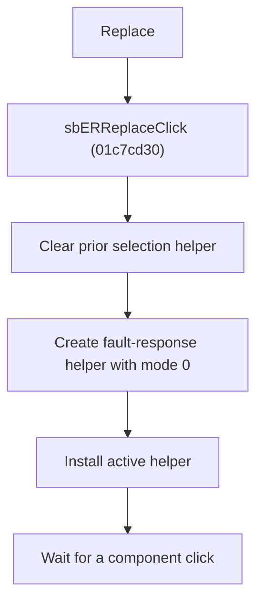

# Replace

> Analysis status: Reviewed from recovered source, shared handlers, resource text, and glyph evidence.

## Control

| Property | Recovered value |
| --- | --- |
| Component path | SchematicEditor.EditorPanel.ExamPanel.ExamMainPages.tsCurTask.GroupBox2.SolPages.tsFault.sbERReplace |
| Control class | TSpeedButton |
| Hint | Replace\|Replace the components you consider are faulty |
| Handler | sbERReplaceClick at 01c7cd30 |

## What happens when clicked

The handler cancels and destroys any existing editor selection helper. It creates a fault-response selection helper with mode byte `0` and installs it as the active helper. The click arms the replacement-selection step; it does not replace a component by itself. A later component click supplies the target to the helper.

## Click flow

## Handler evidence

- Source: [FUN_01c7cd30](../../../DecompiledSources/Tina16/functions/0000000001C7CD30__FUN_01c7cd30.c)
- [FUN_01c6cf20](../../../DecompiledSources/Tina16/functions/0000000001C6CF20__FUN_01c6cf20.c) removes the prior helper. [FUN_01c6cee0](../../../DecompiledSources/Tina16/functions/0000000001C6CEE0__FUN_01c6cee0.c) installs the replacement.
- [FUN_0136c720](../../../DecompiledSources/Tina16/functions/000000000136C720__FUN_0136c720.c) constructs the same helper class as Select Faulty; the recovered mode byte differs.
- Extracted glyph: [Replace glyph](../../../glyph/0363_SchematicEditor_SchematicEditor_EditorPanel_ExamPanel_ExamMainPages_tsCurTask_GroupBox2_SolPages_tsFault_sbERRep_Glyph_Data.png)

## No-op and error behavior

- No component is changed until a later component-selection event.
- The recovered handler has no separate failure dialog.
