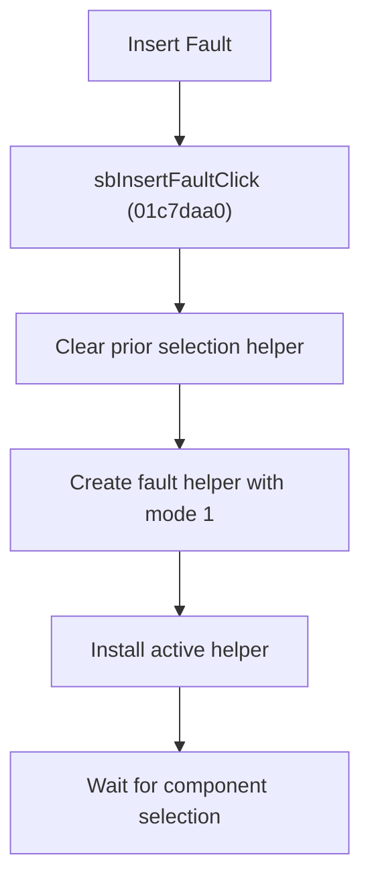

# Insert Fault

> Analysis status: Reviewed from recovered source, shared handlers, resource text, and glyph evidence.

## Control

| Property | Recovered value |
| --- | --- |
| Component path | SchematicEditor.EditorPanel.FaultManager.GroupBox4.FaultPanel.sbInsertFault |
| Control class | TSpeedButton |
| Hint | Insert Fault\|Select the component you want to insert fault into |
| Handler | sbInsertFaultClick at 01c7daa0 |

## What happens when clicked

The handler clears any prior editor selection helper, creates a fault-management helper with mode byte `1`, and installs it as the active helper. It then waits for the user to select a component. The button click does not insert a fault by itself.

## Click flow

## Handler evidence

- Source: [FUN_01c7daa0](../../../DecompiledSources/Tina16/functions/0000000001C7DAA0__FUN_01c7daa0.c)
- [FUN_0136c440](../../../DecompiledSources/Tina16/functions/000000000136C440__FUN_0136c440.c) constructs the helper and stores the supplied mode byte.
- `FUN_01c6cf20` clears the previous helper and `FUN_01c6cee0` installs the new one.
- Extracted glyph: [Insert Fault glyph](../../../glyph/0366_SchematicEditor_SchematicEditor_EditorPanel_FaultManager_GroupBox4_FaultPanel_sbInsertFault_Glyph_Data.png)

## No-op and error behavior

- No circuit fault changes until a later component-selection event.
- The recovered handler has no separate failure dialog.
