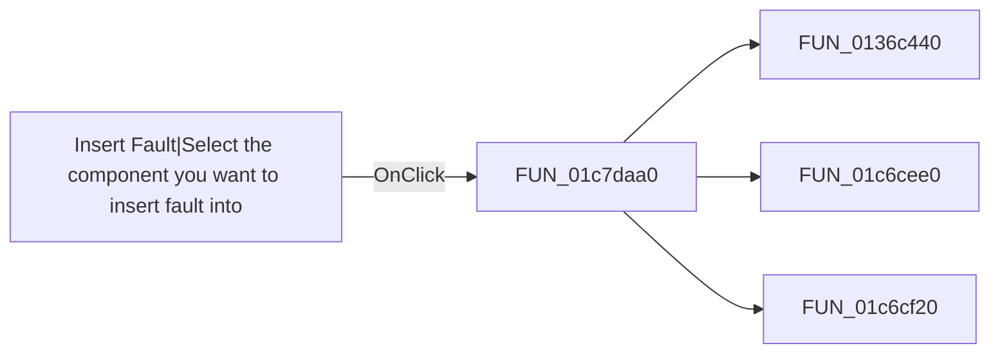

# Insert Fault|Select the component you want to insert fault into

> Analysis status: Pending individual source review.

## Control

| Property | Recovered value |
| --- | --- |
| Form | SchematicEditor |
| Component path | SchematicEditor.EditorPanel.FaultManager.GroupBox4.FaultPanel.sbInsertFault |
| Control class | TSpeedButton |
| Caption | Not present in the recovered resource. |
| Hint | Insert Fault\|Select the component you want to insert fault into |
| Text | Not present in the recovered resource. |
| Handler name | sbInsertFaultClick |
| Handler address | 01c7daa0 |
| Graph node | `resource:dfm:SchematicEditor/SchematicEditor.EditorPanel.FaultManager.GroupBox4.FaultPanel.sbInsertFault` |
| Handler node | `function:01c7daa0` |
| Graph layer | UI |

## What happens when clicked

Pending individual analysis. An agent must read the recovered handler source and its relevant callees before it replaces this text.

## Click flow

## Handler evidence

- Source: [DecompiledSources/Tina16/functions/0000000001C7DAA0__FUN_01c7daa0.c](../../../DecompiledSources/Tina16/functions/0000000001C7DAA0__FUN_01c7daa0.c)
- Recovered role: Not present in the recovered resource.
- Current graph summary: Handles 1 Delphi UI event: SchematicEditor.EditorPanel.FaultManager.GroupBox4.FaultPanel.sbInsertFault.OnClick.
- Current graph behavior: Not present in the recovered resource.
- Current graph evidence: Not present in the recovered resource.
- Complexity: complex
- Distinct outgoing calls: 3

## Direct calls

- `function:0136c440` — FUN_0136c440
- `function:01c6cee0` — FUN_01c6cee0
- `function:01c6cf20` — FUN_01c6cf20

## Resource evidence

- Kind: Not present in the recovered resource.
- Modal result: Not present in the recovered resource.
- Checked state: Not present in the recovered resource.
- List items: Not present in the recovered resource.
- Image reference: Not present in the recovered resource.
- Extracted glyph: [`0366_SchematicEditor_SchematicEditor_EditorPanel_FaultManager_GroupBox4_FaultPanel_sbInsertFault_Glyph_Data.png`](../../../glyph/0366_SchematicEditor_SchematicEditor_EditorPanel_FaultManager_GroupBox4_FaultPanel_sbInsertFault_Glyph_Data.png)

## Nearby label candidates

Nearby labels are layout candidates only. They are not proof of behavior.

- No same-parent label candidate is available.

## Analysis limits

- Do not infer behavior from the control class, caption, hint, glyph, or nearby label alone.
- Do not replace the pending status until the handler source and relevant call path provide enough evidence.
