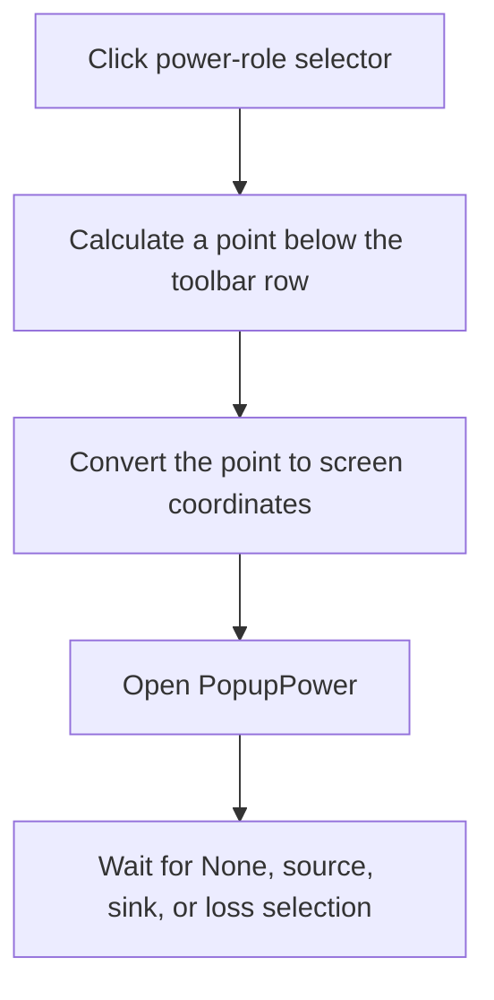

# Set power source/sink/loss

> Analysis status: Complete.

## Control

| Property | Recovered value |
| --- | --- |
| Form | SchematicEditor |
| Component path | SchematicEditor.TopToolBar.EditorTools.sbPower |
| Control class | TSpeedButton |
| Hint | Set power source/sink/loss |
| Handler | `sbPowerClick` at `01c7dae0` |
| Graph nodes | `resource:dfm:SchematicEditor/SchematicEditor.TopToolBar.EditorTools.sbPower` → `function:01c7dae0` |
| Graph layer | UI |

## What happens when clicked

The handler prepares `SchematicEditor.PopupPower` for an explicit pop-up request. It calculates a point two pixels below the toolbar row, converts that point from the control at `+0x16c8` to screen coordinates, and opens the pop-up stored at `+0x16a0`.

The recovered pop-up offers `None`, `Power source`, `Power sink`, and `Power loss`. This click does not assign a power role itself. The selected pop-up-item handler performs that operation. There is no message, retry, or local exception block.

## Click flow

## Evidence

- Handler: [FUN_01c7dae0](../../../DecompiledSources/Tina16/functions/0000000001C7DAE0__FUN_01c7dae0.c)
- Coordinate conversion: [FUN_0064d1f0](../../../DecompiledSources/Tina16/functions/000000000064D1F0__FUN_0064d1f0.c)
- Resource: `SchematicEditor.PopupPower` with `pmPwrNone`, `pmPwrSource`, `pmPwrSink`, and `pmPwrLoss`.
- Extracted glyph: [Power-role glyph](../../../glyph/0351_SchematicEditor_SchematicEditor_TopToolBar_EditorTools_sbPower_Glyph_Data.png)
- Recovered role: Open the power-role selection pop-up below its toolbar control.

## Analysis limits

- The indirect VCL pop-up method name is not recovered. Its exact menu object and coordinate inputs establish the operation.
