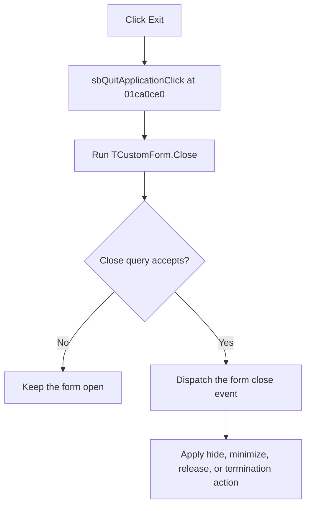

# Exit

> Analysis status: Complete.

## Control

| Property | Recovered value |
| --- | --- |
| Form | SchematicEditor |
| Component path | SchematicEditor.StatusPanel.ButtonPanel.ExitPanel.sbQuitApplication |
| Control class | TSpeedButton |
| Caption | Exit |
| Handler | `sbQuitApplicationClick` at `01ca0ce0` |
| Graph nodes | `resource:dfm:SchematicEditor/SchematicEditor.StatusPanel.ButtonPanel.ExitPanel.sbQuitApplication` → `function:01ca0ce0` |
| Graph layer | UI |

## What happens when clicked

The handler calls the VCL `TCustomForm.Close` pipeline for the Schematic Editor form. For a modeless form, VCL first runs the close query. A rejected query stops closure. Otherwise, VCL dispatches the form close event and applies its selected action, which can hide, minimize, release, or terminate the main form.

For a modal form, the same helper sets modal result `2`. The click handler itself has no separate confirmation, retry, fallback, or exception block. Any save or confirmation behavior comes from the form close-query and close-event handlers, not from this button handler.

## Click flow

## Evidence

- Handler: [FUN_01ca0ce0](../../../DecompiledSources/Tina16/functions/0000000001CA0CE0__FUN_01ca0ce0.c)
- VCL close pipeline: [FUN_00805200](../../../DecompiledSources/Tina16/functions/0000000000805200__FUN_00805200.c)
- Recovered role: Request closure of the Schematic Editor through the VCL close pipeline.
- No extracted glyph is associated with this control.

## Analysis limits

- The button handler does not itself identify which close action the Schematic Editor event selects.
