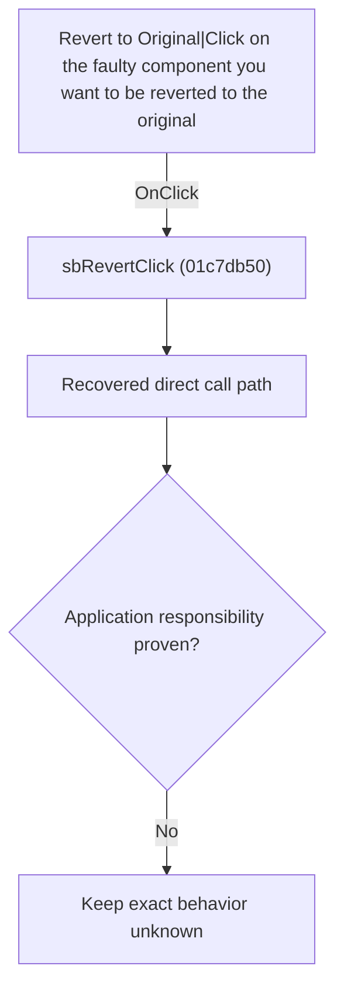

# Revert to Original|Click on the faulty component you want to be reverted to the original

> Analysis status: Blocked by an exact evidence gap.

## Control

| Property | Recovered value |
| --- | --- |
| Form | SchematicEditor |
| Component path | SchematicEditor.EditorPanel.FaultManager.GroupBox4.FaultPanel.sbRevert |
| Control class | TSpeedButton |
| Caption | Not present in the recovered resource. |
| Hint | Revert to Original\|Click on the faulty component you want to be reverted to the original |
| Text | Not present in the recovered resource. |
| Handler name | sbRevertClick |
| Handler address | 01c7db50 |
| Graph node | `resource:dfm:SchematicEditor/SchematicEditor.EditorPanel.FaultManager.GroupBox4.FaultPanel.sbRevert` |
| Handler node | `function:01c7db50` |
| Graph layer | UI |

## What happens when clicked

The OnClick binding reaches sbRevertClick at 01c7db50. The recovered body has 3 distinct outgoing graph call(s), but the application-specific responsibilities and data effects of its downstream path are not established in the accepted graph evidence. The control's caption or name indicates user intent only; it is not enough to claim implementation behavior.

## Click flow

## Handler evidence

- Source: [DecompiledSources/Tina16/functions/0000000001C7DB50__FUN_01c7db50.c](../../../DecompiledSources/Tina16/functions/0000000001C7DB50__FUN_01c7db50.c)
- Recovered role: Evidence-blocked sbRevertClick command.
- Current graph summary: Handles 1 Delphi UI event: SchematicEditor.EditorPanel.FaultManager.GroupBox4.FaultPanel.sbRevert.OnClick.
- Current graph behavior: The OnClick binding reaches sbRevertClick at 01c7db50. The recovered body has 3 distinct outgoing graph call(s), but the application-specific responsibilities and data effects of its downstream path are not established in the accepted graph evidence. The control's caption or name indicates user intent only; it is not enough to claim implementation behavior.
- Current graph evidence: The DFM binds SchematicEditor.EditorPanel.FaultManager.GroupBox4.FaultPanel.sbRevert to sbRevertClick. The recovered source is DecompiledSources/Tina16/functions/0000000001C7DB50__FUN_01c7db50.c and directly references 0136c440, 01c6cee0, 01c6cf20. No accepted end-to-end role was established for this control path.
- Complexity: complex
- Distinct outgoing calls: 3

## Direct calls

- `function:0136c440` — FUN_0136c440
- `function:01c6cee0` — FUN_01c6cee0
- `function:01c6cf20` — FUN_01c6cf20

## Resource evidence

- Kind: Not present in the recovered resource.
- Modal result: Not present in the recovered resource.
- Checked state: Not present in the recovered resource.
- List items: Not present in the recovered resource.
- Image reference: Not present in the recovered resource.
- Extracted glyph: [`0367_SchematicEditor_SchematicEditor_EditorPanel_FaultManager_GroupBox4_FaultPanel_sbRevert_Glyph_Data.png`](../../../glyph/0367_SchematicEditor_SchematicEditor_EditorPanel_FaultManager_GroupBox4_FaultPanel_sbRevert_Glyph_Data.png)

## Nearby label candidates

Nearby labels are layout candidates only. They are not proof of behavior.

- No same-parent label candidate is available.

## Analysis limits

- Exact gap: the recovered handler or one of its direct application callees lacks a source-supported role that proves the command's decisions, state changes, and output. Keep this Bead open until those callees are traced.

