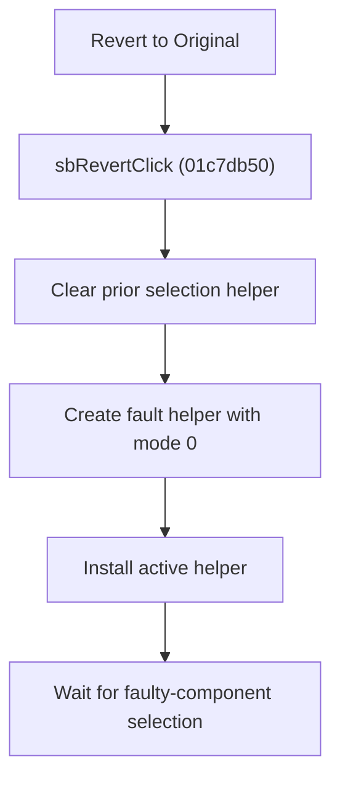

# Revert to Original

> Analysis status: Reviewed from recovered source, shared handlers, resource text, and glyph evidence.

## Control

| Property | Recovered value |
| --- | --- |
| Component path | SchematicEditor.EditorPanel.FaultManager.GroupBox4.FaultPanel.sbRevert |
| Control class | TSpeedButton |
| Hint | Revert to Original\|Click on the faulty component you want to be reverted to the original |
| Handler | sbRevertClick at 01c7db50 |

## What happens when clicked

The handler clears any prior editor selection helper, creates the same fault-management helper used by Insert Fault with mode byte `0`, and installs it as the active helper. It then waits for a faulty-component click. The button does not revert a component by itself.

## Click flow

## Handler evidence

- Source: [FUN_01c7db50](../../../DecompiledSources/Tina16/functions/0000000001C7DB50__FUN_01c7db50.c)
- [FUN_0136c440](../../../DecompiledSources/Tina16/functions/000000000136C440__FUN_0136c440.c) constructs the helper. Its mode byte distinguishes this path from Insert Fault.
- `FUN_01c6cf20` clears the previous helper and `FUN_01c6cee0` installs the new one.
- Extracted glyph: [Revert glyph](../../../glyph/0367_SchematicEditor_SchematicEditor_EditorPanel_FaultManager_GroupBox4_FaultPanel_sbRevert_Glyph_Data.png)

## No-op and error behavior

- No component changes until a later component-selection event.
- The recovered handler has no separate failure dialog.
