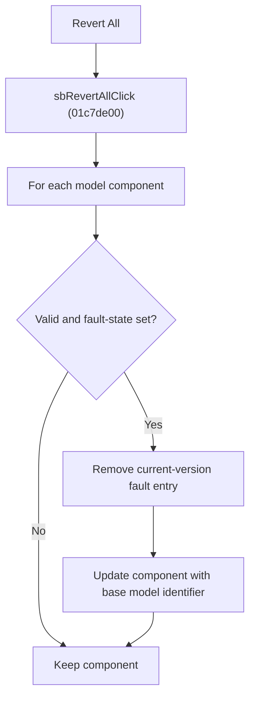

# Revert All

> Analysis status: Reviewed from recovered source, field consumers, resource text, and glyph evidence.

## Control

| Property | Recovered value |
| --- | --- |
| Component path | SchematicEditor.EditorPanel.FaultManager.GroupBox4.FaultPanel.sbRevertAll |
| Control class | TSpeedButton |
| Hint | Revert All\|Reverts all faults |
| Handler | sbRevertAllClick at 01c7de00 |

## What happens when clicked

The handler iterates every component in the editor model. For each valid component that has its recovered fault-state byte set, it removes that component's entry from the current version's fault list and invokes the component update method with the base model identifier. Components that fail the validity test or do not have the fault-state byte set are unchanged.

## Click flow

## Handler evidence

- Source: [FUN_01c7de00](../../../DecompiledSources/Tina16/functions/0000000001C7DE00__FUN_01c7de00.c)
- [FUN_01c7dd90](../../../DecompiledSources/Tina16/functions/0000000001C7DD90__FUN_01c7dd90.c) applies the validity and fault-state tests to each component.
- [FUN_017ff250](../../../DecompiledSources/Tina16/functions/00000000017FF250__FUN_017ff250.c) returns the component byte at offset `0x52` used by the fault-state test.
- [FUN_012bea40](../../../DecompiledSources/Tina16/functions/00000000012BEA40__FUN_012bea40.c) removes and destroys the matching component entry in the current version's fault collection.
- [FUN_01c7d720](../../../DecompiledSources/Tina16/functions/0000000001C7D720__FUN_01c7d720.c) is a parallel recovered path that updates fault-state components with the same base model identifier.
- Extracted glyph: [Revert All glyph](../../../glyph/0368_SchematicEditor_SchematicEditor_EditorPanel_FaultManager_GroupBox4_FaultPanel_sbRevertAll_Glyph_Data.png)

## No-op and error behavior

- An empty component list, an invalid component, or a component without the recovered fault-state byte causes no change for that item.
- The handler does not show a confirmation dialog.
