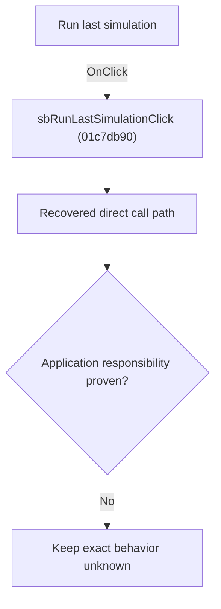

# Run last simulation

> Analysis status: Blocked by an exact evidence gap.

## Control

| Property | Recovered value |
| --- | --- |
| Form | SchematicEditor |
| Component path | SchematicEditor.TopToolBar.EditorTools.sbRunLastSimulation |
| Control class | TSpeedButton |
| Caption | Not present in the recovered resource. |
| Hint | Run last simulation |
| Text | Not present in the recovered resource. |
| Handler name | sbRunLastSimulationClick |
| Handler address | 01c7db90 |
| Graph node | `resource:dfm:SchematicEditor/SchematicEditor.TopToolBar.EditorTools.sbRunLastSimulation` |
| Handler node | `function:01c7db90` |
| Graph layer | UI |

## What happens when clicked

The OnClick binding reaches sbRunLastSimulationClick at 01c7db90. The recovered body has 8 distinct outgoing graph call(s), but the application-specific responsibilities and data effects of its downstream path are not established in the accepted graph evidence. The control's caption or name indicates user intent only; it is not enough to claim implementation behavior.

## Click flow

## Handler evidence

- Source: [DecompiledSources/Tina16/functions/0000000001C7DB90__FUN_01c7db90.c](../../../DecompiledSources/Tina16/functions/0000000001C7DB90__FUN_01c7db90.c)
- Recovered role: Evidence-blocked sbRunLastSimulationClick command.
- Current graph summary: Handles 1 Delphi UI event: SchematicEditor.TopToolBar.EditorTools.sbRunLastSimulation.OnClick.
- Current graph behavior: The OnClick binding reaches sbRunLastSimulationClick at 01c7db90. The recovered body has 8 distinct outgoing graph call(s), but the application-specific responsibilities and data effects of its downstream path are not established in the accepted graph evidence. The control's caption or name indicates user intent only; it is not enough to claim implementation behavior.
- Current graph evidence: The DFM binds SchematicEditor.TopToolBar.EditorTools.sbRunLastSimulation to sbRunLastSimulationClick. The recovered source is DecompiledSources/Tina16/functions/0000000001C7DB90__FUN_01c7db90.c and directly references 00414480, 00416db0, 00417580, 00417740, 00419430, 00536640, 00545db0, 00557c30. No accepted end-to-end role was established for this control path.
- Complexity: complex
- Distinct outgoing calls: 8

## Direct calls

- `function:00414480` — Delphi UnicodeString clear and finalization helper
- `function:00416db0` — FUN_00416db0
- `function:00417580` — FUN_00417580
- `function:00417740` — FUN_00417740
- `function:00419430` — FUN_00419430
- `function:00536640` — FUN_00536640
- `function:00545db0` — FUN_00545db0
- `function:00557c30` — FUN_00557c30

## Resource evidence

- Kind: Not present in the recovered resource.
- Modal result: Not present in the recovered resource.
- Checked state: Not present in the recovered resource.
- List items: Not present in the recovered resource.
- Image reference: Not present in the recovered resource.
- Extracted glyph: [`0352_SchematicEditor_SchematicEditor_TopToolBar_EditorTools_sbRunLastSimulation_Glyph_Data.png`](../../../glyph/0352_SchematicEditor_SchematicEditor_TopToolBar_EditorTools_sbRunLastSimulation_Glyph_Data.png)

## Nearby label candidates

Nearby labels are layout candidates only. They are not proof of behavior.

- No same-parent label candidate is available.

## Analysis limits

- Exact gap: the recovered handler or one of its direct application callees lacks a source-supported role that proves the command's decisions, state changes, and output. Keep this Bead open until those callees are traced.

