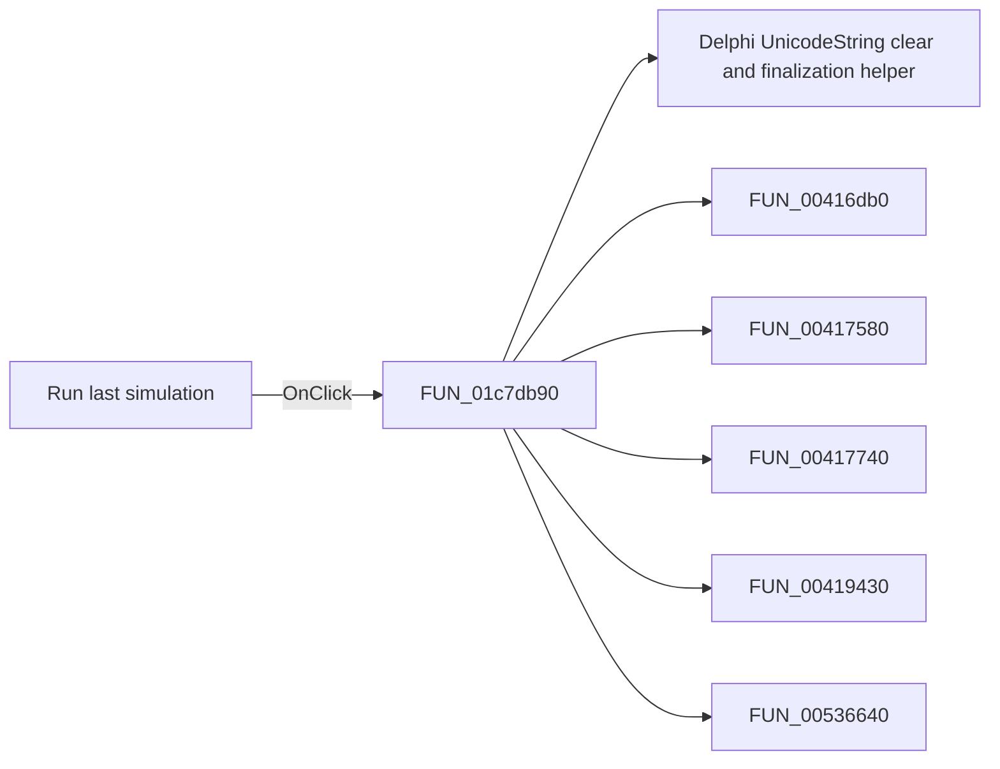

# Run last simulation

> Analysis status: Pending individual source review.

## Control

| Property | Recovered value |
| --- | --- |
| Form | SchematicEditor |
| Component path | SchematicEditor.TopToolBar.EditorTools.sbRunLastSimulation |
| Control class | TSpeedButton |
| Caption | Not present in the recovered resource. |
| Hint | Run last simulation |
| Text | Not present in the recovered resource. |
| Handler name | sbRunLastSimulationClick |
| Handler address | 01c7db90 |
| Graph node | `resource:dfm:SchematicEditor/SchematicEditor.TopToolBar.EditorTools.sbRunLastSimulation` |
| Handler node | `function:01c7db90` |
| Graph layer | UI |

## What happens when clicked

Pending individual analysis. An agent must read the recovered handler source and its relevant callees before it replaces this text.

## Click flow

## Handler evidence

- Source: [DecompiledSources/Tina16/functions/0000000001C7DB90__FUN_01c7db90.c](../../../DecompiledSources/Tina16/functions/0000000001C7DB90__FUN_01c7db90.c)
- Recovered role: Not present in the recovered resource.
- Current graph summary: Handles 1 Delphi UI event: SchematicEditor.TopToolBar.EditorTools.sbRunLastSimulation.OnClick.
- Current graph behavior: Not present in the recovered resource.
- Current graph evidence: Not present in the recovered resource.
- Complexity: complex
- Distinct outgoing calls: 8

## Direct calls

- `function:00414480` — Delphi UnicodeString clear and finalization helper
- `function:00416db0` — FUN_00416db0
- `function:00417580` — FUN_00417580
- `function:00417740` — FUN_00417740
- `function:00419430` — FUN_00419430
- `function:00536640` — FUN_00536640
- `function:00545db0` — FUN_00545db0
- `function:00557c30` — FUN_00557c30

## Resource evidence

- Kind: Not present in the recovered resource.
- Modal result: Not present in the recovered resource.
- Checked state: Not present in the recovered resource.
- List items: Not present in the recovered resource.
- Image reference: Not present in the recovered resource.
- Extracted glyph: [`0352_SchematicEditor_SchematicEditor_TopToolBar_EditorTools_sbRunLastSimulation_Glyph_Data.png`](../../../glyph/0352_SchematicEditor_SchematicEditor_TopToolBar_EditorTools_sbRunLastSimulation_Glyph_Data.png)

## Nearby label candidates

Nearby labels are layout candidates only. They are not proof of behavior.

- No same-parent label candidate is available.

## Analysis limits

- Do not infer behavior from the control class, caption, hint, glyph, or nearby label alone.
- Do not replace the pending status until the handler source and relevant call path provide enough evidence.
