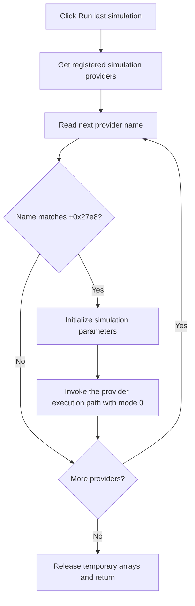

# Run last simulation

> Analysis status: Complete.

## Control

| Property | Recovered value |
| --- | --- |
| Form | SchematicEditor |
| Component path | SchematicEditor.TopToolBar.EditorTools.sbRunLastSimulation |
| Control class | TSpeedButton |
| Hint | Run last simulation |
| Handler | `sbRunLastSimulationClick` at `01c7db90` |
| Graph nodes | `resource:dfm:SchematicEditor/SchematicEditor.TopToolBar.EditorTools.sbRunLastSimulation` → `function:01c7db90` |
| Graph layer | UI |

## What happens when clicked

The handler asks the application registry for all objects of provider class VMT `01c4d9f0`. It reads each provider's name through virtual method `+0x10` and compares it with the last-simulation name stored in the Schematic Editor at `+0x27e8`.

When a provider name matches, the handler initializes an empty simulation-parameter record and calls the provider's virtual execution path through `FUN_00557c30`, passing the Schematic Editor and mode `0`. It then continues through the provider list, so duplicate provider names would each run.

If the stored name is null, the provider list is empty, or no provider name matches, the click is a no-op. The recovered handler does not show an error or fall back to another simulation. It has no local exception block.

## Click flow

## Evidence

- Handler: [FUN_01c7db90](../../../DecompiledSources/Tina16/functions/0000000001C7DB90__FUN_01c7db90.c)
- Provider registry lookup: [FUN_00545db0](../../../DecompiledSources/Tina16/functions/0000000000545DB0__FUN_00545db0.c)
- Provider execution wrapper: [FUN_00557c30](../../../DecompiledSources/Tina16/functions/0000000000557C30__FUN_00557c30.c)
- Extracted glyph: [Run-last-simulation glyph](../../../glyph/0352_SchematicEditor_SchematicEditor_TopToolBar_EditorTools_sbRunLastSimulation_Glyph_Data.png)
- Recovered role: Find the stored last-simulation provider and run it with the current Schematic Editor context.

## Analysis limits

- The provider class and stored-name field do not have recovered Delphi names. Their registry enumeration, name comparison, and execution data flow establish their roles.
