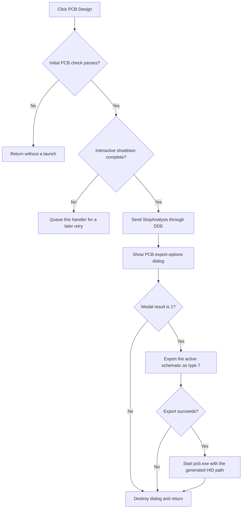

# PCB Design

> Analysis status: Complete.

## Control

| Property | Recovered value |
| --- | --- |
| Form | SchematicEditor |
| Component path | SchematicEditor.TopToolBar.EditorTools.sbStartPCBDesigner |
| Control class | TSpeedButton |
| Hint | PCB Design |
| Handler | `sbStartPCBDesignerClick` at `01c99370` |
| Graph nodes | `resource:dfm:SchematicEditor/SchematicEditor.TopToolBar.EditorTools.sbStartPCBDesigner` → `function:01c99370` |
| Graph layer | UI |

## What happens when clicked

The handler first checks `FUN_01b1ee00`. A nonzero result stops the command. Otherwise, it asks `FUN_01c87d20` to leave interactive mode. If interactive shutdown is not complete, it queues this same handler and returns so the action can retry later.

After shutdown, the handler sends DDE message `StopAnalysis()`, creates the PCB export-options dialog, and runs it modally. Only result `1` continues. The accepted path builds the `.NET` input name and calls `FUN_01b41bc0` for the active schematic with type `7`. When that export succeeds, it builds the `pcb.exe` executable path and the generated `.HID` argument path, then calls `FUN_01d44af0` to start the PCB program.

A failed initial check, a canceled dialog, or a failed export causes no launch. The dialog is destroyed on every normal exit. The handler has no local exception block.

## Click flow

## Evidence

- Handler: [FUN_01c99370](../../../DecompiledSources/Tina16/functions/0000000001C99370__FUN_01c99370.c)
- Interactive shutdown: [FUN_01c87d20](../../../DecompiledSources/Tina16/functions/0000000001C87D20__FUN_01c87d20.c)
- DDE dispatch: [FUN_017fe450](../../../DecompiledSources/Tina16/functions/00000000017FE450__FUN_017fe450.c)
- Export path: [FUN_01b41bc0](../../../DecompiledSources/Tina16/functions/0000000001B41BC0__FUN_01b41bc0.c)
- Process start: [FUN_01d44af0](../../../DecompiledSources/Tina16/functions/0000000001D44AF0__FUN_01d44af0.c)
- Extracted glyph: [PCB Design glyph](../../../glyph/0347_SchematicEditor_SchematicEditor_TopToolBar_EditorTools_sbStartPCBDesigner_Glyph_Data.png)
- Recovered role: Export the active schematic and start the PCB designer after interactive analysis stops.

## Analysis limits

- The initial `FUN_01b1ee00` predicate does not have a recovered Delphi name. This article keeps that gate explicit.
