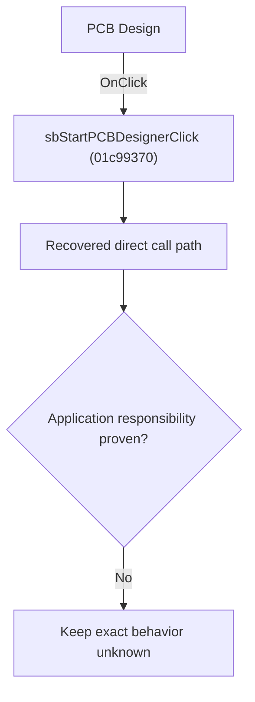

# PCB Design

> Analysis status: Blocked by an exact evidence gap.

## Control

| Property | Recovered value |
| --- | --- |
| Form | SchematicEditor |
| Component path | SchematicEditor.TopToolBar.EditorTools.sbStartPCBDesigner |
| Control class | TSpeedButton |
| Caption | Not present in the recovered resource. |
| Hint | PCB Design |
| Text | Not present in the recovered resource. |
| Handler name | sbStartPCBDesignerClick |
| Handler address | 01c99370 |
| Graph node | `resource:dfm:SchematicEditor/SchematicEditor.TopToolBar.EditorTools.sbStartPCBDesigner` |
| Handler node | `function:01c99370` |
| Graph layer | UI |

## What happens when clicked

The OnClick binding reaches sbStartPCBDesignerClick at 01c99370. The recovered body has 15 distinct outgoing graph call(s), but the application-specific responsibilities and data effects of its downstream path are not established in the accepted graph evidence. The control's caption or name indicates user intent only; it is not enough to claim implementation behavior.

## Click flow

## Handler evidence

- Source: [DecompiledSources/Tina16/functions/0000000001C99370__FUN_01c99370.c](../../../DecompiledSources/Tina16/functions/0000000001C99370__FUN_01c99370.c)
- Recovered role: Evidence-blocked sbStartPCBDesignerClick command.
- Current graph summary: Handles 1 Delphi UI event: SchematicEditor.TopToolBar.EditorTools.sbStartPCBDesigner.OnClick.
- Current graph behavior: The OnClick binding reaches sbStartPCBDesignerClick at 01c99370. The recovered body has 15 distinct outgoing graph call(s), but the application-specific responsibilities and data effects of its downstream path are not established in the accepted graph evidence. The control's caption or name indicates user intent only; it is not enough to claim implementation behavior.
- Current graph evidence: The DFM binds SchematicEditor.TopToolBar.EditorTools.sbStartPCBDesigner to sbStartPCBDesignerClick. The recovered source is DecompiledSources/Tina16/functions/0000000001C99370__FUN_01c99370.c and directly references 00410f20, 00414560, 00416ad0, 00416cd0, 0043f780, 004414c0, 00441920, 007fc180, and 7 more. No accepted end-to-end role was established for this control path.
- Complexity: complex
- Distinct outgoing calls: 15

## Direct calls

- `function:00410f20` — Nil-safe Delphi object destruction helper
- `function:00414560` — Delphi UnicodeString array finalization helper
- `function:00416ad0` — FUN_00416ad0
- `function:00416cd0` — FUN_00416cd0
- `function:0043f780` — FUN_0043f780
- `function:004414c0` — FUN_004414c0
- `function:00441920` — FUN_00441920
- `function:007fc180` — FUN_007fc180
- `function:00f836b0` — FUN_00f836b0
- `function:010e33a0` — FUN_010e33a0
- `function:017fe450` — FUN_017fe450
- `function:01b1ee00` — FUN_01b1ee00
- `function:01b41bc0` — FUN_01b41bc0
- `function:01c87d20` — FUN_01c87d20
- `function:01d44af0` — FUN_01d44af0

## Resource evidence

- Kind: Not present in the recovered resource.
- Modal result: Not present in the recovered resource.
- Checked state: Not present in the recovered resource.
- List items: Not present in the recovered resource.
- Image reference: Not present in the recovered resource.
- Extracted glyph: [`0347_SchematicEditor_SchematicEditor_TopToolBar_EditorTools_sbStartPCBDesigner_Glyph_Data.png`](../../../glyph/0347_SchematicEditor_SchematicEditor_TopToolBar_EditorTools_sbStartPCBDesigner_Glyph_Data.png)

## Nearby label candidates

Nearby labels are layout candidates only. They are not proof of behavior.

- No same-parent label candidate is available.

## Analysis limits

- Exact gap: the recovered handler or one of its direct application callees lacks a source-supported role that proves the command's decisions, state changes, and output. Keep this Bead open until those callees are traced.

