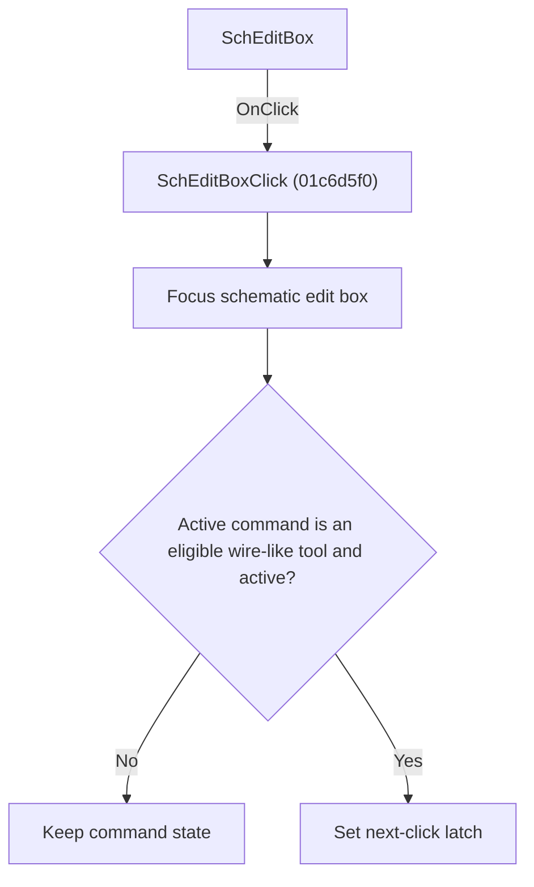

# SchEditBox

> Analysis status: Individually reviewed.

## Control

| Property | Recovered value |
| --- | --- |
| Form | SchematicEditor |
| Component path | SchematicEditor.EditorPanel.SchEditBox |
| Control class | TSchEditBox |
| Caption | Not present in the recovered resource. |
| Hint | Not present in the recovered resource. |
| Text | Not present in the recovered resource. |
| Handler name | SchEditBoxClick |
| Handler address | 01c6d5f0 |
| Graph node | `resource:dfm:SchematicEditor/SchematicEditor.EditorPanel.SchEditBox` |
| Handler node | `function:01c6d5f0` |
| Graph layer | UI |

## What happens when clicked

The handler focuses the schematic edit box. If the active command is one of two recovered wire-like tool classes and that tool is active, it also sets the tool's next-click latch. Other active commands only receive the focus change.

## Click flow

## Handler evidence

- Source: [DecompiledSources/Tina16/functions/0000000001C6D5F0__FUN_01c6d5f0.c](../../../DecompiledSources/Tina16/functions/0000000001C6D5F0__FUN_01c6d5f0.c)
- Recovered role: Focus the schematic editor and arm an active wire tool.
- Current graph summary: Handles 1 Delphi UI event: SchematicEditor.EditorPanel.SchEditBox.OnClick.
- Current graph behavior: The handler focuses the schematic edit box. If the active command is one of two recovered wire-like tool classes and that tool is active, it also sets the tool's next-click latch. Other active commands only receive the focus change.
- Current graph evidence: The recovered body calls the edit box focus method, tests the active-command class against two VMT values, checks its active byte, and sets a second byte. The DFM binds this address to SchEditBox.OnClick.
- Complexity: moderate
- Distinct outgoing calls: 2

## Direct calls

- `function:004113d0` — FUN_004113d0
- `function:00801e40` — FUN_00801e40

## Resource evidence

- Kind: Not present in the recovered resource.
- Modal result: Not present in the recovered resource.
- Checked state: Not present in the recovered resource.
- List items: Not present in the recovered resource.
- Image reference: Not present in the recovered resource.
- Extracted glyph: None.

## Nearby label candidates

Nearby labels are layout candidates only. They are not proof of behavior.

- No same-parent label candidate is available.

## Analysis limits

- The two command class names and the latched field name are not present in the recovered symbols.

