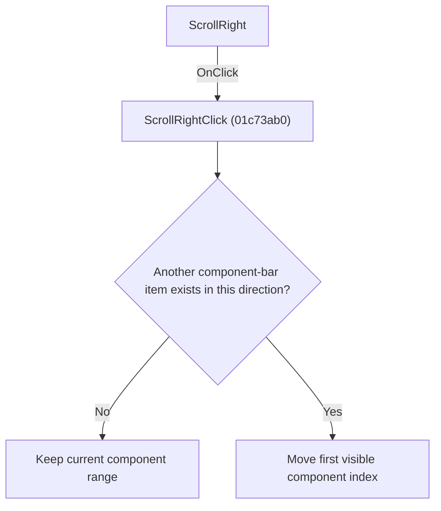

# ScrollRight

> Analysis status: Individually reviewed.

## Control

| Property | Recovered value |
| --- | --- |
| Form | SchematicEditor |
| Component path | SchematicEditor.ComponentPanel.ScrollRight |
| Control class | TSpeedButton |
| Caption | Not present in the recovered resource. |
| Hint | Not present in the recovered resource. |
| Text | Not present in the recovered resource. |
| Handler name | ScrollRightClick |
| Handler address | 01c73ab0 |
| Graph node | `resource:dfm:SchematicEditor/SchematicEditor.ComponentPanel.ScrollRight` |
| Handler node | `function:01c73ab0` |
| Graph layer | UI |

## What happens when clicked

The handler adjusts the first visible component index by one within its valid bounds. The numeric direction is reversed for a right-to-left interface so the visible movement still follows the control direction.

## Click flow

## Handler evidence

- Source: [DecompiledSources/Tina16/functions/0000000001C73AB0__FUN_01c73ab0.c](../../../DecompiledSources/Tina16/functions/0000000001C73AB0__FUN_01c73ab0.c)
- Recovered role: Scroll the component bar toward its following items.
- Current graph summary: Handles 1 Delphi UI event: SchematicEditor.ComponentPanel.ScrollRight.OnClick.
- Current graph behavior: The handler adjusts the first visible component index by one within its valid bounds. The numeric direction is reversed for a right-to-left interface so the visible movement still follows the control direction.
- Current graph evidence: The recovered body reads the component-panel start index and language direction, applies the opposite bounded increment or decrement from ScrollLeftClick, and refreshes the panel. The DFM binds it to ScrollRight.OnClick.
- Complexity: moderate
- Distinct outgoing calls: 2

## Direct calls

- `function:00848960` — FUN_00848960
- `function:00b89270` — FUN_00b89270

## Resource evidence

- Kind: Not present in the recovered resource.
- Modal result: Not present in the recovered resource.
- Checked state: Not present in the recovered resource.
- List items: Not present in the recovered resource.
- Image reference: Not present in the recovered resource.
- Extracted glyph: [`0323_SchematicEditor_SchematicEditor_ComponentPanel_ScrollRight_Glyph_Data.png`](../../../glyph/0323_SchematicEditor_SchematicEditor_ComponentPanel_ScrollRight_Glyph_Data.png)

## Nearby label candidates

Nearby labels are layout candidates only. They are not proof of behavior.

- No same-parent label candidate is available.

## Analysis limits

- The panel index field is recovered only by offset.

