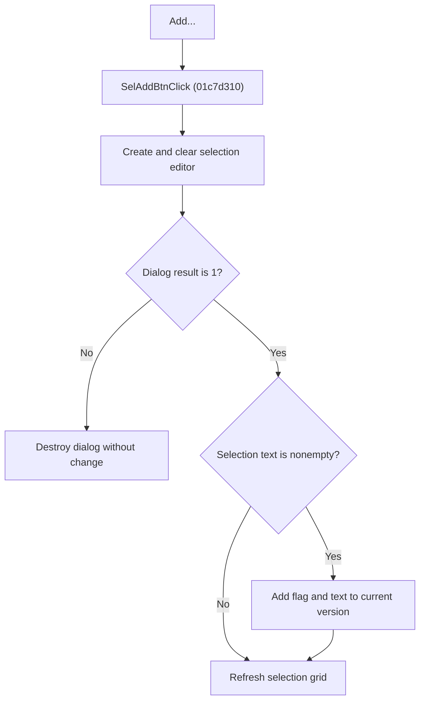

# Add Selection

> Analysis status: Reviewed from recovered source, dialog and list helpers, and resource evidence.

## Control

| Property | Recovered value |
| --- | --- |
| Component path | SchematicEditor.EditorPanel.FaultManager.nbExMan.tsExManSelection.GroupBox5.SelAddBtn |
| Control class | TButton |
| Caption | Add... |
| Handler | SelAddBtnClick at 01c7d310 |

## What happens when clicked

The handler creates and clears the selection-editor dialog. If the dialog returns modal result `1`, it reads the dialog flag and text, and adds a selection condition to the current version when the text is not empty. It then refreshes the two-column selection grid. Cancel closes the dialog without adding a condition. The dialog is destroyed on both paths.

## Click flow

## Handler evidence

- Source: [FUN_01c7d310](../../../DecompiledSources/Tina16/functions/0000000001C7D310__FUN_01c7d310.c)
- [FUN_012beb90](../../../DecompiledSources/Tina16/functions/00000000012BEB90__FUN_012beb90.c) rejects empty text and adds the flag/text pair to the current version's selection collection.
- [FUN_01c7cf40](../../../DecompiledSources/Tina16/functions/0000000001C7CF40__FUN_01c7cf40.c) rebuilds the two-column grid from that collection.

## No-op and error behavior

- Cancel: no condition is added.
- Empty accepted text: the model helper adds nothing; the handler still refreshes the grid.
