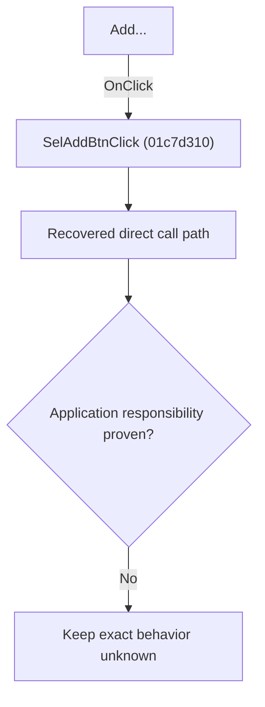

# Add...

> Analysis status: Blocked by an exact evidence gap.

## Control

| Property | Recovered value |
| --- | --- |
| Form | SchematicEditor |
| Component path | SchematicEditor.EditorPanel.FaultManager.nbExMan.tsExManSelection.GroupBox5.SelAddBtn |
| Control class | TButton |
| Caption | Add... |
| Hint | Not present in the recovered resource. |
| Text | Not present in the recovered resource. |
| Handler name | SelAddBtnClick |
| Handler address | 01c7d310 |
| Graph node | `resource:dfm:SchematicEditor/SchematicEditor.EditorPanel.FaultManager.nbExMan.tsExManSelection.GroupBox5.SelAddBtn` |
| Handler node | `function:01c7d310` |
| Graph layer | UI |

## What happens when clicked

The OnClick binding reaches SelAddBtnClick at 01c7d310. The recovered body has 8 distinct outgoing graph call(s), but the application-specific responsibilities and data effects of its downstream path are not established in the accepted graph evidence. The control's caption or name indicates user intent only; it is not enough to claim implementation behavior.

## Click flow

## Handler evidence

- Source: [DecompiledSources/Tina16/functions/0000000001C7D310__FUN_01c7d310.c](../../../DecompiledSources/Tina16/functions/0000000001C7D310__FUN_01c7d310.c)
- Recovered role: Evidence-blocked SelAddBtnClick command.
- Current graph summary: Handles 1 Delphi UI event: SchematicEditor.EditorPanel.FaultManager.nbExMan.tsExManSelection.GroupBox5.SelAddBtn.OnClick.
- Current graph behavior: The OnClick binding reaches SelAddBtnClick at 01c7d310. The recovered body has 8 distinct outgoing graph call(s), but the application-specific responsibilities and data effects of its downstream path are not established in the accepted graph evidence. The control's caption or name indicates user intent only; it is not enough to claim implementation behavior.
- Current graph evidence: The DFM binds SchematicEditor.EditorPanel.FaultManager.nbExMan.tsExManSelection.GroupBox5.SelAddBtn to SelAddBtnClick. The recovered source is DecompiledSources/Tina16/functions/0000000001C7D310__FUN_01c7d310.c and directly references 00410f20, 00414480, 0064dd90, 0064de00, 007fc180, 012beb90, 01c7cf40, 01c7d9d0. No accepted end-to-end role was established for this control path.
- Complexity: complex
- Distinct outgoing calls: 8

## Direct calls

- `function:00410f20` — Nil-safe Delphi object destruction helper
- `function:00414480` — Delphi UnicodeString clear and finalization helper
- `function:0064dd90` — VCL control Unicode text reader
- `function:0064de00` — VCL control text setter with change suppression
- `function:007fc180` — FUN_007fc180
- `function:012beb90` — FUN_012beb90
- `function:01c7cf40` — FUN_01c7cf40
- `function:01c7d9d0` — FUN_01c7d9d0

## Resource evidence

- Kind: Not present in the recovered resource.
- Modal result: Not present in the recovered resource.
- Checked state: Not present in the recovered resource.
- List items: Not present in the recovered resource.
- Image reference: Not present in the recovered resource.
- Extracted glyph: None.

## Nearby label candidates

Nearby labels are layout candidates only. They are not proof of behavior.

- No same-parent label candidate is available.

## Analysis limits

- Exact gap: the recovered handler or one of its direct application callees lacks a source-supported role that proves the command's decisions, state changes, and output. Keep this Bead open until those callees are traced.

