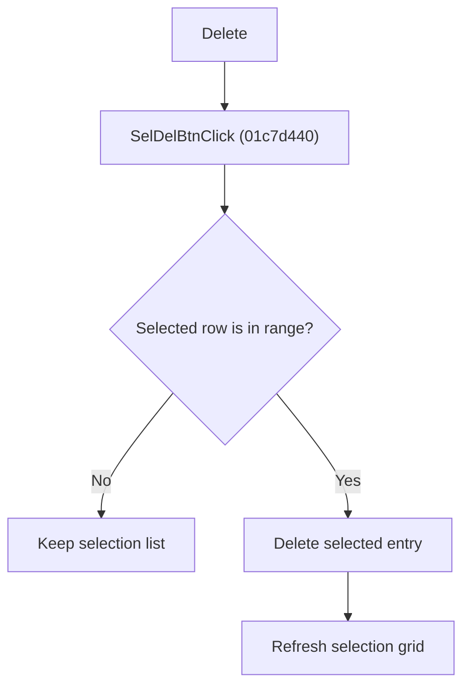

# Delete Selection

> Analysis status: Reviewed from recovered source, list helper, and resource evidence.

## Control

| Property | Recovered value |
| --- | --- |
| Component path | SchematicEditor.EditorPanel.FaultManager.nbExMan.tsExManSelection.GroupBox5.SelDelBtn |
| Control class | TButton |
| Caption | Delete |
| Handler | SelDelBtnClick at 01c7d440 |

## What happens when clicked

The handler reads the selected row of the selection grid. If the row index is within the current version's selection collection, it deletes that entry and refreshes the grid. A negative or out-of-range row does nothing. The handler does not ask for confirmation.

## Click flow

## Handler evidence

- Source: [FUN_01c7d440](../../../DecompiledSources/Tina16/functions/0000000001C7D440__FUN_01c7d440.c)
- The handler reads the grid selection index at its recovered field offset and compares it with the current collection count.
- The collection virtual method at offset `0x98` removes the entry.
- [FUN_01c7cf40](../../../DecompiledSources/Tina16/functions/0000000001C7CF40__FUN_01c7cf40.c) refreshes the grid after deletion.

## No-op and error behavior

- No selection or an out-of-range selection: no change and no refresh.
- No confirmation or separate error path is present.
