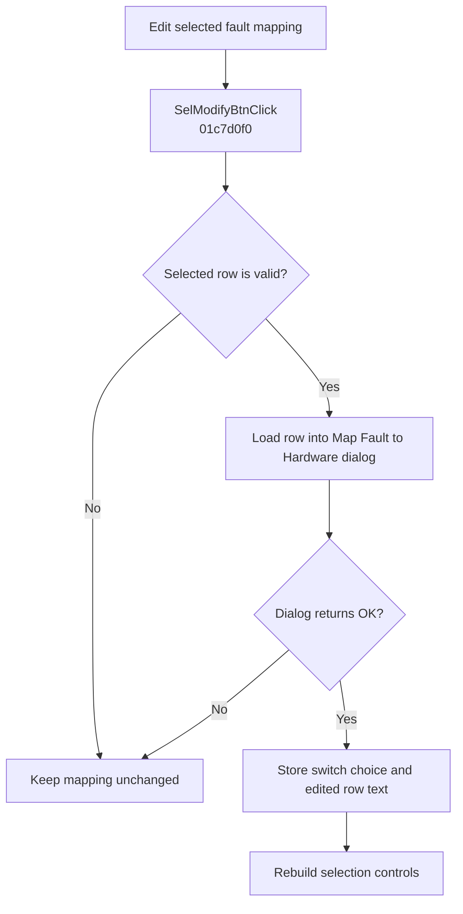

# Edit...

> Analysis status: Evidence-backed behavior recovered.

## Control

| Property | Recovered value |
| --- | --- |
| Form | SchematicEditor |
| Component path | SchematicEditor.EditorPanel.FaultManager.nbExMan.tsExManSelection.GroupBox5.SelModifyBtn |
| Control class | TButton |
| Caption | Edit... |
| Hint | Not present in the recovered resource. |
| Text | Not present in the recovered resource. |
| Handler name | SelModifyBtnClick |
| Handler address | 01c7d0f0 |
| Graph node | `resource:dfm:SchematicEditor/SchematicEditor.EditorPanel.FaultManager.nbExMan.tsExManSelection.GroupBox5.SelModifyBtn` |
| Handler node | `function:01c7d0f0` |
| Graph layer | UI |

## What happens when clicked

The handler reads the selected row index from the selection control at form offset `0x1468`. A negative index or an index outside the current fault-mapping list is a no-op. For a valid row, it creates `TMapFaultDlg`, whose resource caption is “Map Fault to Hardware,” and loads the current row data into the dialog.

If the dialog returns modal result 1, the handler reads the dialog's switch choice, updates the selected mapping through `FUN_012BEAE0`, writes the edited text back through the list interface, and calls `FUN_01C7CF40` to rebuild the selection controls. Cancel frees the dialog without changing the list.

## Click flow

## Handler evidence

- Source: [DecompiledSources/Tina16/functions/0000000001C7D0F0__FUN_01c7d0f0.c](../../../DecompiledSources/Tina16/functions/0000000001C7D0F0__FUN_01c7d0f0.c)
- Recovered role: Edits the selected external fault-to-hardware mapping.
- Current graph summary: Handles 1 Delphi UI event: SchematicEditor.EditorPanel.FaultManager.nbExMan.tsExManSelection.GroupBox5.SelModifyBtn.OnClick.
- Current graph behavior: The handler opens `TMapFaultDlg` for a valid selected row and commits its switch and text data only for modal result 1.
- Current graph evidence: The constructor pointer matches the `TMapFaultDlg` class table. The DFM supplies the Map Fault to Hardware caption and `SwitchGrid`; `FUN_012BEAE0` updates the selected mapping and `FUN_01C7CF40` rebuilds the row controls.
- Complexity: complex
- Distinct outgoing calls: 8

## Direct calls

- `function:00410f20` — Nil-safe Delphi object destruction helper
- `function:00414480` — Delphi UnicodeString clear and finalization helper
- `function:0064dd90` — VCL control Unicode text reader
- `function:0064de00` — VCL control text setter with change suppression
- `function:007fc180` — FUN_007fc180
- `function:012beae0` — FUN_012beae0
- `function:01c7cf40` — FUN_01c7cf40
- `function:01c7d9d0` — FUN_01c7d9d0

## Resource evidence

- Kind: Not present in the recovered resource.
- Modal result: Not present in the recovered resource.
- Checked state: Not present in the recovered resource.
- List items: Not present in the recovered resource.
- Image reference: Not present in the recovered resource.
- Extracted glyph: None.

## Nearby label candidates

Nearby labels are layout candidates only. They are not proof of behavior.

- No same-parent label candidate is available.

## Analysis limits

- The recovered virtual list interface does not expose a Delphi field name for each stored row value. The selected-row checks and commit boundary are proven.

