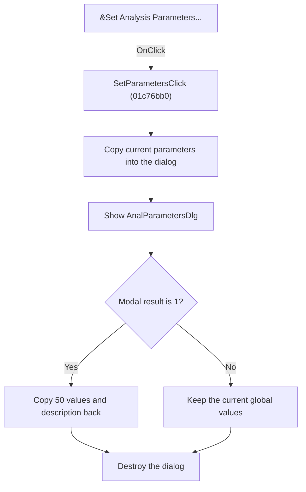

# Set Analysis Parameters

> Analysis status: Reviewed from recovered source and graph evidence.

## Control

| Property | Recovered value |
| --- | --- |
| Form | SchematicEditor |
| Component path | SchematicEditor.MainMenu.mnAnalysis.SetParameters |
| Control class | TMenuItem |
| Caption | &Set Analysis Parameters... |
| Handler name | SetParametersClick |
| Handler address | 01c76bb0 |
| Graph node | `resource:dfm:SchematicEditor/SchematicEditor.MainMenu.mnAnalysis.SetParameters` |
| Handler node | `function:01c76bb0` |
| Graph layer | UI |

## What happens when clicked

Copies the current analysis parameters and description into AnalParametersDlg, shows the dialog, and copies the staged values back only when the modal result is 1. Cancel leaves the global values unchanged.

## Click flow

## Handler evidence

- Source: [DecompiledSources/Tina16/functions/0000000001C76BB0__FUN_01c76bb0.c](../../../DecompiledSources/Tina16/functions/0000000001C76BB0__FUN_01c76bb0.c)
- Recovered role: Edit global analysis parameters in a modal staging dialog.
- Evidence: The handler constructs AnalParametersDlg through FUN_01152540 with the global parameter block at +200 and description at +600. After ShowModal, only result 1 copies 50 eight-byte slots and the description back. All paths destroy the dialog.

## Application-relevant calls

- FUN_01152540 constructs the dialog and stages the caller values.

## Resource evidence

- The DFM binds this menu item to `SetParametersClick`.
- The recovered caption is `&Set Analysis Parameters...`.
- No extracted glyph is associated with this control.

## Analysis limits

- The recovered names of some form fields and global state bytes are not available. This article identifies them by stable offsets and proven readers or writers where necessary.