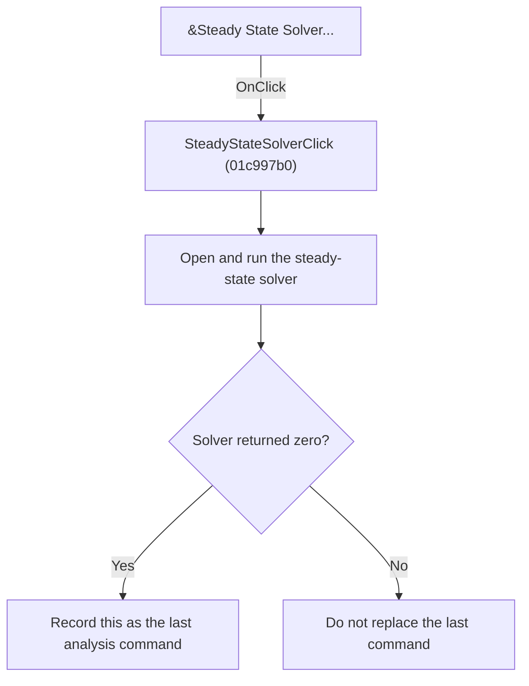

# Steady State Solver

> Analysis status: Reviewed from recovered source and graph evidence.

## Control

| Property | Recovered value |
| --- | --- |
| Form | SchematicEditor |
| Component path | SchematicEditor.MainMenu.mnAnalysis.SteadyStateSolver |
| Control class | TMenuItem |
| Caption | &Steady State Solver... |
| Handler name | SteadyStateSolverClick |
| Handler address | 01c997b0 |
| Graph node | `resource:dfm:SchematicEditor/SchematicEditor.MainMenu.mnAnalysis.SteadyStateSolver` |
| Handler node | `function:01c997b0` |
| Graph layer | UI |

## What happens when clicked

Runs the steady-state solver dialog and solver path. It records SteadyStateSolverClick as the last analysis command only when the solver returns zero for successful completion.

## Click flow

## Handler evidence

- Source: [DecompiledSources/Tina16/functions/0000000001C997B0__FUN_01c997b0.c](../../../DecompiledSources/Tina16/functions/0000000001C997B0__FUN_01c997b0.c)
- Recovered role: Run the steady-state solver.
- Evidence: The handler calls FUN_0134d990 and tests its return. FUN_0134d990 creates and configures the solver and modal parameter dialog, treats modal result 2 as cancel or failure, runs the solver only on the accepted path, and returns a status. The handler writes SteadyStateSolverClick to SchematicEditor +0x27e8 only for return zero.

## Application-relevant calls

- FUN_0134d990 owns the solver dialog, execution, and cleanup.

## Resource evidence

- The DFM binds this menu item to `SteadyStateSolverClick`.
- The recovered caption is `&Steady State Solver...`.
- No extracted glyph is associated with this control.

## Analysis limits

- The recovered names of some form fields and global state bytes are not available. This article identifies them by stable offsets and proven readers or writers where necessary.