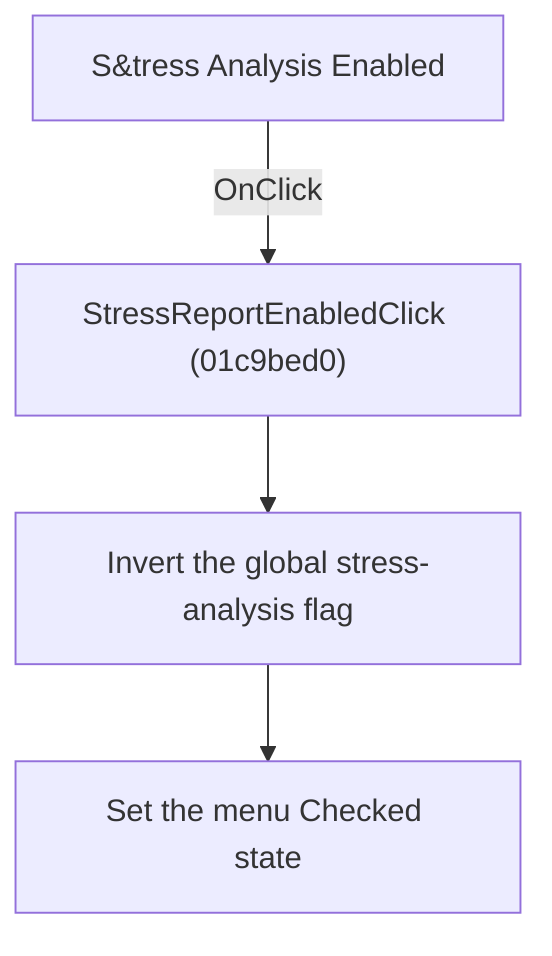

# Stress Analysis Enabled

> Analysis status: Reviewed from recovered source and graph evidence.

## Control

| Property | Recovered value |
| --- | --- |
| Form | SchematicEditor |
| Component path | SchematicEditor.MainMenu.mnAnalysis.StressReportEnabled |
| Control class | TMenuItem |
| Caption | S&tress Analysis Enabled |
| Handler name | StressReportEnabledClick |
| Handler address | 01c9bed0 |
| Graph node | `resource:dfm:SchematicEditor/SchematicEditor.MainMenu.mnAnalysis.StressReportEnabled` |
| Handler node | `function:01c9bed0` |
| Graph layer | UI |

## What happens when clicked

Inverts the global stress-analysis flag and sets the menu item Checked state to the new value.

## Click flow

## Handler evidence

- Source: [DecompiledSources/Tina16/functions/0000000001C9BED0__FUN_01c9bed0.c](../../../DecompiledSources/Tina16/functions/0000000001C9BED0__FUN_01c9bed0.c)
- Recovered role: Toggle stress analysis.
- Evidence: The recovered handler reads and inverts global byte 0x817. It then passes the menu item at SchematicEditor +0x1290 and the new byte value to FUN_007e2d20. The common editor refresh path also reads this flag and synchronizes the same menu item.

## Application-relevant calls

- FUN_007e2d20 synchronizes the menu check mark.

## Resource evidence

- The DFM binds this menu item to `StressReportEnabledClick`.
- The recovered caption is `S&tress Analysis Enabled`.
- No extracted glyph is associated with this control.

## Analysis limits

- The recovered names of some form fields and global state bytes are not available. This article identifies them by stable offsets and proven readers or writers where necessary.