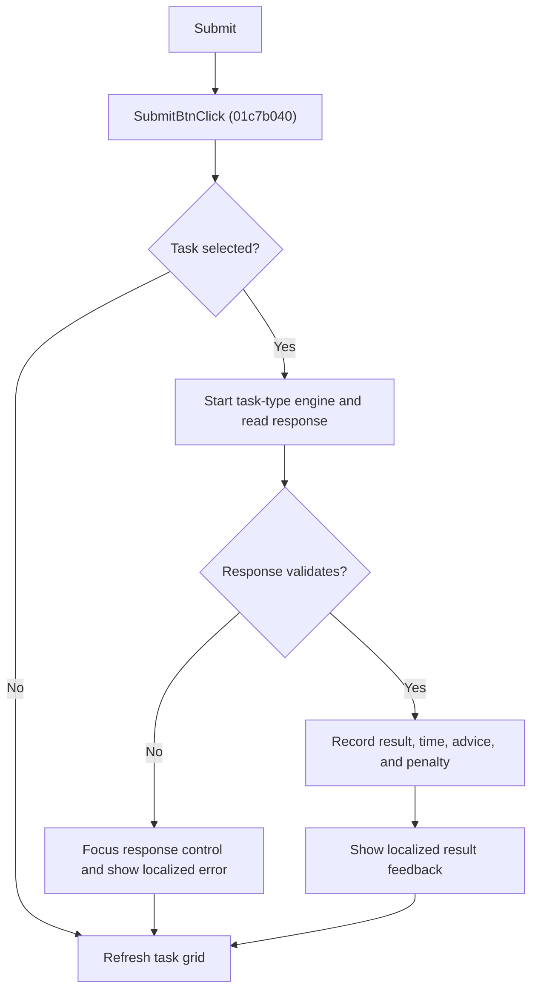

# Submit

> Analysis status: Reviewed from recovered source, callers, call paths, and glyph evidence.

## Control

| Property | Recovered value |
| --- | --- |
| Component path | SchematicEditor.EditorPanel.ExamPanel.ExamMainPages.tsCurTask.GroupBox2.SubmitBtn |
| Control class | TBitBtn |
| Caption | Submit |
| Handler | SubmitBtnClick at 01c7b040 |

## What happens when clicked

The handler resolves the selected exam task. If no task is selected, it only runs its final grid refresh. For task types `1`, `2`, and `5`, it first starts the corresponding recovered task engine. It then validates the applicable response controls, parses one or two response expressions when required, and submits the values to the task model. It records the attempt, elapsed time, advice indexes, and accumulated penalty through `FUN_01c796f0` when the validation path succeeds. It shows localized feedback for success or for the returned validation error code, updates result counters for non-expression tasks, and refreshes the task grid.

## Click flow

## Handler evidence

- Source: [FUN_01c7b040](../../../DecompiledSources/Tina16/functions/0000000001C7B040__FUN_01c7b040.c)
- [FUN_01c7acf0](../../../DecompiledSources/Tina16/functions/0000000001C7ACF0__FUN_01c7acf0.c) resolves the selected task-grid item.
- `FUN_01320bb0`, `FUN_013911a0`, and `FUN_01373b60` are dispatched for recovered task type bytes `1`, `2`, and `5`.
- `FUN_017f1230` parses an entered response and `FUN_012bf5d0` submits it against the current task data. Returned nonzero codes select a localized error message and the related response control.
- [FUN_01c796f0](../../../DecompiledSources/Tina16/functions/0000000001C796F0__FUN_01c796f0.c) marks the selected task attempted and stores response text, result values, elapsed time, advice indexes, and accumulated penalty.
- [FUN_01c7cd70](../../../DecompiledSources/Tina16/functions/0000000001C7CD70__FUN_01c7cd70.c) performs the final task-grid refresh. Other recovered callers can invoke the same submission path after an interpreter run.
- Extracted glyph: [Submit glyph](../../../glyph/0361_SchematicEditor_SchematicEditor_EditorPanel_ExamPanel_ExamMainPages_tsCurTask_GroupBox2_SubmitBtn_Glyph_Data.png)

## No-op and error behavior

- No selected task: no submission or result record is created.
- Invalid input or a model rejection: the handler shows the mapped localized message and does not run the success-record path.
- The exact localized message text is not recovered in the function source.
