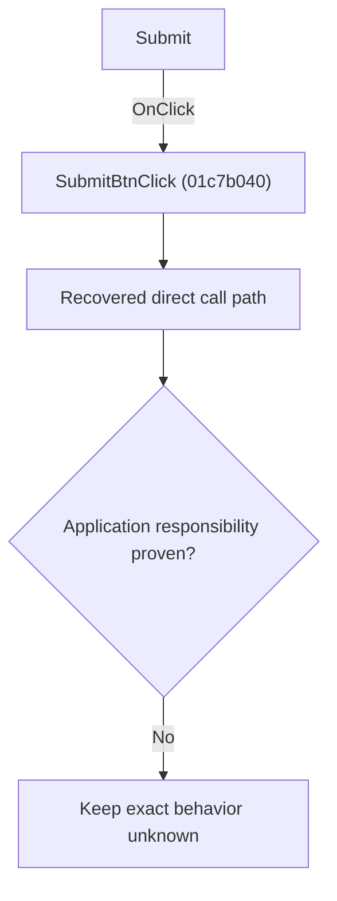

# Submit

> Analysis status: Blocked by an exact evidence gap.

## Control

| Property | Recovered value |
| --- | --- |
| Form | SchematicEditor |
| Component path | SchematicEditor.EditorPanel.ExamPanel.ExamMainPages.tsCurTask.GroupBox2.SubmitBtn |
| Control class | TBitBtn |
| Caption | Submit |
| Hint | Not present in the recovered resource. |
| Text | Not present in the recovered resource. |
| Handler name | SubmitBtnClick |
| Handler address | 01c7b040 |
| Graph node | `resource:dfm:SchematicEditor/SchematicEditor.EditorPanel.ExamPanel.ExamMainPages.tsCurTask.GroupBox2.SubmitBtn` |
| Handler node | `function:01c7b040` |
| Graph layer | UI |

## What happens when clicked

The OnClick binding reaches SubmitBtnClick at 01c7b040. The recovered body has 27 distinct outgoing graph call(s), but the application-specific responsibilities and data effects of its downstream path are not established in the accepted graph evidence. The control's caption or name indicates user intent only; it is not enough to claim implementation behavior.

## Click flow

## Handler evidence

- Source: [DecompiledSources/Tina16/functions/0000000001C7B040__FUN_01c7b040.c](../../../DecompiledSources/Tina16/functions/0000000001C7B040__FUN_01c7b040.c)
- Recovered role: Evidence-blocked SubmitBtnClick command.
- Current graph summary: Handles 1 Delphi UI event: SchematicEditor.EditorPanel.ExamPanel.ExamMainPages.tsCurTask.GroupBox2.SubmitBtn.OnClick.
- Current graph behavior: The OnClick binding reaches SubmitBtnClick at 01c7b040. The recovered body has 27 distinct outgoing graph call(s), but the application-specific responsibilities and data effects of its downstream path are not established in the accepted graph evidence. The control's caption or name indicates user intent only; it is not enough to claim implementation behavior.
- Current graph evidence: The DFM binds SchematicEditor.EditorPanel.ExamPanel.ExamMainPages.tsCurTask.GroupBox2.SubmitBtn to SubmitBtnClick. The recovered source is DecompiledSources/Tina16/functions/0000000001C7B040__FUN_01c7b040.c and directly references 0040e780, 004113d0, 00414480, 00414560, 00414b50, 004169a0, 00416cd0, 00416dc0, and 19 more. No accepted end-to-end role was established for this control path.
- Complexity: complex
- Distinct outgoing calls: 27

## Direct calls

- `function:0040e780` — FUN_0040e780
- `function:004113d0` — FUN_004113d0
- `function:00414480` — Delphi UnicodeString clear and finalization helper
- `function:00414560` — Delphi UnicodeString array finalization helper
- `function:00414b50` — FUN_00414b50
- `function:004169a0` — FUN_004169a0
- `function:00416cd0` — FUN_00416cd0
- `function:00416dc0` — FUN_00416dc0
- `function:004170c0` — FUN_004170c0
- `function:00680ad0` — FUN_00680ad0
- `function:0072d440` — FUN_0072d440
- `function:00801e40` — FUN_00801e40
- `function:00b89270` — FUN_00b89270
- `function:00b8e520` — FUN_00b8e520
- `function:00b94e60` — FUN_00b94e60
- `function:012bf5d0` — FUN_012bf5d0
- `function:01320bb0` — FUN_01320bb0
- `function:01373b60` — FUN_01373b60
- `function:013911a0` — FUN_013911a0
- `function:017e1bd0` — FUN_017e1bd0
- `function:017f1230` — FUN_017f1230
- `function:01c796f0` — FUN_01c796f0
- `function:01c7acf0` — FUN_01c7acf0
- `function:01c7ad30` — FUN_01c7ad30
- `function:01c7aea0` — FUN_01c7aea0
- `function:01c7af80` — FUN_01c7af80
- `function:01c7cd70` — FUN_01c7cd70

## Resource evidence

- Kind: Not present in the recovered resource.
- Modal result: Not present in the recovered resource.
- Checked state: Not present in the recovered resource.
- List items: Not present in the recovered resource.
- Image reference: Not present in the recovered resource.
- Extracted glyph: [`0361_SchematicEditor_SchematicEditor_EditorPanel_ExamPanel_ExamMainPages_tsCurTask_GroupBox2_SubmitBtn_Glyph_Data.png`](../../../glyph/0361_SchematicEditor_SchematicEditor_EditorPanel_ExamPanel_ExamMainPages_tsCurTask_GroupBox2_SubmitBtn_Glyph_Data.png)

## Nearby label candidates

Nearby labels are layout candidates only. They are not proof of behavior.

- No same-parent label candidate is available.

## Analysis limits

- Exact gap: the recovered handler or one of its direct application callees lacks a source-supported role that proves the command's decisions, state changes, and output. Keep this Bead open until those callees are traced.

