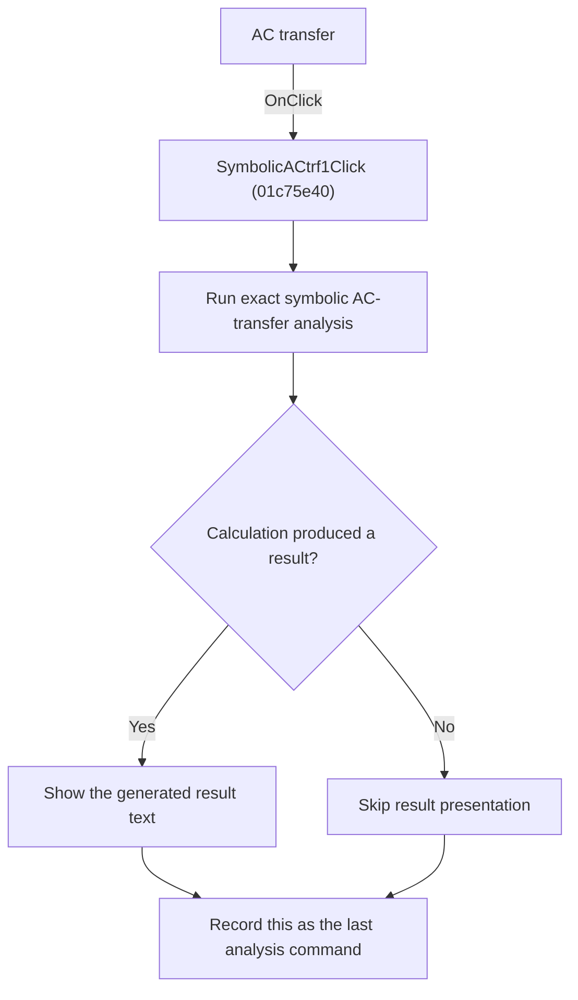

# AC transfer

> Analysis status: Reviewed from recovered source and graph evidence.

## Control

| Property | Recovered value |
| --- | --- |
| Form | SchematicEditor |
| Component path | SchematicEditor.MainMenu.mnAnalysis.Symbolic1.SymbolicACtrf1 |
| Control class | TMenuItem |
| Caption | AC transfer |
| Handler name | SymbolicACtrf1Click |
| Handler address | 01c75e40 |
| Graph node | `resource:dfm:SchematicEditor/SchematicEditor.MainMenu.mnAnalysis.Symbolic1.SymbolicACtrf1` |
| Handler node | `function:01c75e40` |
| Graph layer | UI |

## What happens when clicked

Runs the exact symbolic AC-transfer calculation for the current circuit and registers this command as the last analysis command after the calculation returns.

## Click flow

## Handler evidence

- Source: [DecompiledSources/Tina16/functions/0000000001C75E40__FUN_01c75e40.c](../../../DecompiledSources/Tina16/functions/0000000001C75E40__FUN_01c75e40.c)
- Recovered role: Run exact symbolic AC-transfer analysis.
- Evidence: The handler calls FUN_0145e790 with mode 0 and SchematicEditor +0x2788. The callee selects its exact symbolic path, generates result text, and presents it when the engine is not aborted. The handler then writes SymbolicACtrf1Click to +0x27e8.

## Application-relevant calls

- FUN_0145e790 calculates and presents the AC transfer.

## Resource evidence

- The DFM binds this menu item to `SymbolicACtrf1Click`.
- The recovered caption is `AC transfer`.
- No extracted glyph is associated with this control.

## Analysis limits

- The recovered names of some form fields and global state bytes are not available. This article identifies them by stable offsets and proven readers or writers where necessary.