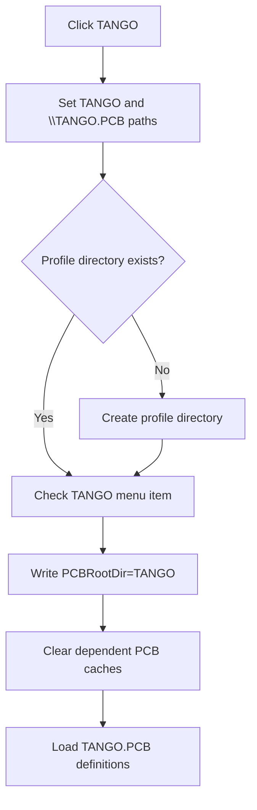

# TANGO

> Analysis status: Reviewed from the recovered PCB profile, directory, settings, cache, and menu-state path.

## Control

| Property | Recovered value |
| --- | --- |
| Form | SchematicEditor |
| Component path | SchematicEditor.MainMenu.mnFile.pcbdirectory1.TANGOPCB1 |
| Control class | TMenuItem |
| Caption | TANGO |
| Hint | Not present in the recovered resource. |
| Text | Not present in the recovered resource. |
| Handler name | TANGOPCB1Click |
| Handler address | 01c95430 |
| Graph node | `resource:dfm:SchematicEditor/SchematicEditor.MainMenu.mnFile.pcbdirectory1.TANGOPCB1` |
| Handler node | `function:01c95430` |
| Graph layer | UI |

## What happens when clicked

The handler selects the TANGO PCB profile. It clears the prior PCB-directory cache, sets `\TANGO.PCB` and `TANGO`, creates the profile directory when absent, checks this item, writes `PCBRootDir=TANGO` in the `Schematic Editor` settings section, clears two dependent caches, and reloads the TANGO `.PCB` definition data. It does not export a board in this handler.

## Click flow

## Handler evidence

- Source: [DecompiledSources/Tina16/functions/0000000001C95430__FUN_01c95430.c](../../../DecompiledSources/Tina16/functions/0000000001C95430__FUN_01c95430.c)
- Recovered role: Select and load the TANGO PCB profile.
- Current graph summary: Handles 1 Delphi UI event: SchematicEditor.MainMenu.mnFile.pcbdirectory1.TANGOPCB1.OnClick.
- Current graph behavior: Selects, persists, and reloads the TANGO PCB definition profile.
- Current graph evidence: `FUN_01c95430` contains `\TANGO.PCB`, `TANGO`, `Schematic Editor`, and `PCBRootDir`; then checks the menu item, clears caches, and invokes the recovered `.PCB` loader.
- Complexity: complex
- Distinct outgoing calls: 10

## Direct calls

- `function:00414560` — Delphi UnicodeString array finalization helper
- `function:00414ad0` — Delphi UnicodeString assignment helper
- `function:00416ba0` — FUN_00416ba0
- `function:00442400` — FUN_00442400
- `function:007e2d20` — FUN_007e2d20
- `function:00b96de0` — FUN_00b96de0
- `function:00eadc90` — FUN_00eadc90
- `function:00eae050` — FUN_00eae050
- `function:00ec0300` — FUN_00ec0300
- `function:00ecbc20` — FUN_00ecbc20

## Resource evidence

- Kind: Not present in the recovered resource.
- Modal result: Not present in the recovered resource.
- Checked state: Not present in the recovered resource.
- List items: Not present in the recovered resource.
- Image reference: Not present in the recovered resource.
- Extracted glyph: None.

## Nearby label candidates

Nearby labels are layout candidates only. They are not proof of behavior.

- No same-parent label candidate is available.

## Analysis limits

- Directory, settings, and definition-load errors are not caught in this handler.

