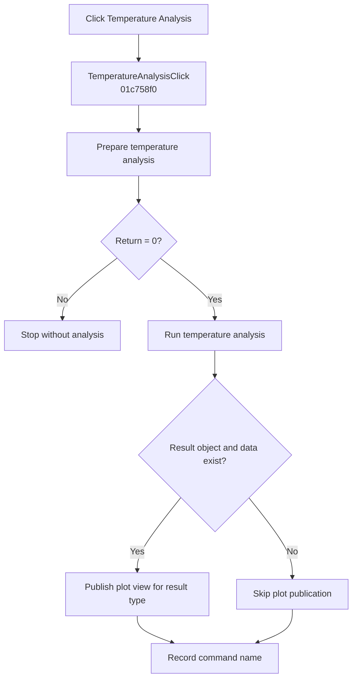

# &Temperature Analysis...

> Analysis status: Complete. A zero setup result runs temperature analysis and publishes its available plot result.

## Control

| Property | Recovered value |
| --- | --- |
| Form | SchematicEditor |
| Component path | SchematicEditor.MainMenu.mnAnalysis.DCAnalysis.TemperatureAnalysis1 |
| Control class | TMenuItem |
| Caption | &Temperature Analysis... |
| Hint | Not present in the recovered resource. |
| Text | Not present in the recovered resource. |
| Handler name | TemperatureAnalysisClick |
| Handler address | 01c758f0 |
| Graph node | `resource:dfm:SchematicEditor/SchematicEditor.MainMenu.mnAnalysis.DCAnalysis.TemperatureAnalysis1` |
| Handler node | `function:01c758f0` |
| Graph layer | UI |

## What happens when clicked

`FUN_01c758f0` calls `FUN_01328250` with the active schematic. A nonzero return stops the handler before analysis and leaves the command string unchanged.

For a zero return, the handler runs `FUN_013d45f0` with the active circuit data and interactive flag `1`. That function creates a numbered Temperature result, registers `Analysis Result 1`, updates the analysis workspace, and refreshes the UI. If the active result object and its data pointer exist, the handler publishes the applicable plot view through `FUN_013c7550`. It then records `TemperatureAnalysisClick`.

## Click flow

## Handler evidence

- Source: [DecompiledSources/Tina16/functions/0000000001C758F0__FUN_01c758f0.c](../../../DecompiledSources/Tina16/functions/0000000001C758F0__FUN_01c758f0.c)
- Recovered role: Runs and publishes temperature analysis after accepted setup.
- Current graph summary: Handles 1 Delphi UI event: SchematicEditor.MainMenu.mnAnalysis.DCAnalysis.TemperatureAnalysis1.OnClick.
- Current graph behavior: Stops on a nonzero setup result. Otherwise, runs temperature analysis, publishes an available typed plot result, and records the command.
- Current graph evidence: `FUN_01c758f0` branches on `FUN_01328250`, calls `FUN_013d45f0` only for zero, checks the active result and its `+8` data pointer, and passes the type byte at `+0x434` to `FUN_013c7550`. The runner creates the recovered Temperature result and refreshes the result UI.
- Complexity: complex
- Distinct outgoing calls: 4

## Direct calls

- `function:00414ad0` — Records the command name
- `function:01328250` — Prepares temperature analysis and returns a stop-or-continue status
- `function:013c7550` — Publishes the available typed plot result
- `function:013d45f0` — Runs temperature analysis and registers its result

## Resource evidence

- Kind: Not present in the recovered resource.
- Modal result: Not present in the recovered resource.
- Checked state: Not present in the recovered resource.
- List items: Not present in the recovered resource.
- Image reference: Not present in the recovered resource.
- Extracted glyph: None.

## Nearby label candidates

Nearby labels are layout candidates only. They are not proof of behavior.

- No same-parent label candidate is available.

## Analysis limits

- A nonzero setup result can include cancellation or setup failure; the wrapper does not distinguish them.
- The handler has no local exception, retry, or rollback path.
