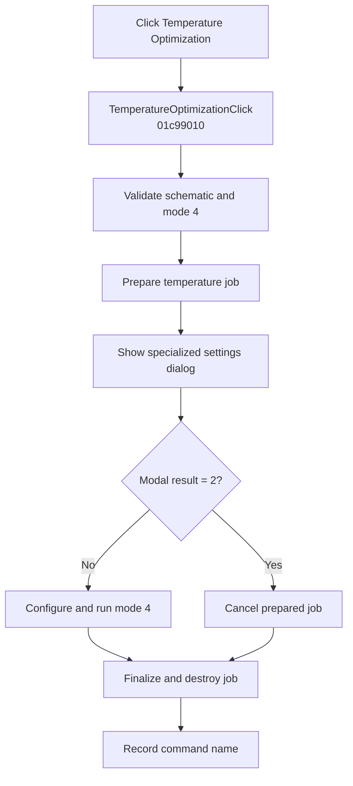

# Temperature...

> Analysis status: Complete. The handler prepares interactive temperature optimization mode 4 and honors modal cancellation.

## Control

| Property | Recovered value |
| --- | --- |
| Form | SchematicEditor |
| Component path | SchematicEditor.MainMenu.mnAnalysis.Optimization.TemperatureOptimization |
| Control class | TMenuItem |
| Caption | Temperature... |
| Hint | Not present in the recovered resource. |
| Text | Not present in the recovered resource. |
| Handler name | TemperatureOptimizationClick |
| Handler address | 01c99010 |
| Graph node | `resource:dfm:SchematicEditor/SchematicEditor.MainMenu.mnAnalysis.Optimization.TemperatureOptimization` |
| Handler node | `function:01c99010` |
| Graph layer | UI |

## What happens when clicked

`FUN_01c99010` calls `FUN_01374440` with the active schematic and interactive selector `0`. The shared routine verifies that two required schematic collections are not empty and that optimization mode `4` is available. It prepares a temperature optimization job and opens the specialized modal settings dialog.

Modal result `2` cancels the job and takes the cancellation cleanup path. Any other result configures mode `4`, runs and finalizes the job, and destroys it. The handler records `TemperatureOptimizationClick` after the shared routine returns, including after Cancel.

## Click flow

## Handler evidence

- Source: [DecompiledSources/Tina16/functions/0000000001C99010__FUN_01c99010.c](../../../DecompiledSources/Tina16/functions/0000000001C99010__FUN_01c99010.c)
- Recovered role: Runs the interactive temperature optimization mode-4 path.
- Current graph summary: Handles 1 Delphi UI event: SchematicEditor.MainMenu.mnAnalysis.Optimization.TemperatureOptimization.OnClick.
- Current graph behavior: Validates the schematic, prepares and prompts for temperature optimization, cancels for modal result 2, or configures and runs mode 4, then cleans up and records the command.
- Current graph evidence: `FUN_01c99010` calls `FUN_01374440` with selector 0. That callee checks the two required collections and capability mode 4, prepares the specialized job, shows the modal class at `PTR_FUN_0136f2b8`, treats result 2 as Cancel, and otherwise calls the mode-4 configure, run, finalize, and destruction path.
- Complexity: moderate
- Distinct outgoing calls: 2

## Direct calls

- `function:00414ad0` — Records the command name
- `function:01374440` — Validates, prompts, and runs temperature optimization mode 4

## Resource evidence

- Kind: Not present in the recovered resource.
- Modal result: Not present in the recovered resource.
- Checked state: Not present in the recovered resource.
- List items: Not present in the recovered resource.
- Image reference: Not present in the recovered resource.
- Extracted glyph: None.

## Nearby label candidates

Nearby labels are layout candidates only. They are not proof of behavior.

- No same-parent label candidate is available.

## Analysis limits

- Localized validation errors are owned by the shared routine.
- The handler records its command name after both acceptance and cancellation.
- Internal optimizer convergence and failure codes are not returned to the wrapper.
